## 1
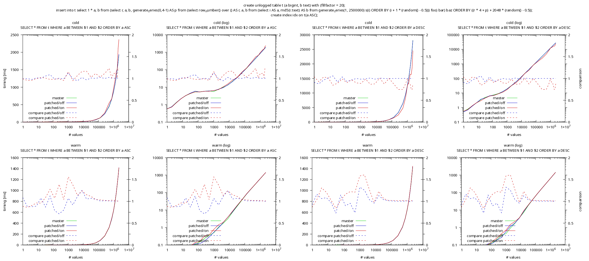
[pdf](pdf/1-io_uring.pdf)
[dataset](20251213-171700/datasets/1)
[Q1](20251213-171700/templates/3)
[Q2](20251213-171700/templates/4)
[Q3](20251213-171700/templates/3)
[Q4](20251213-171700/templates/2)
## 2
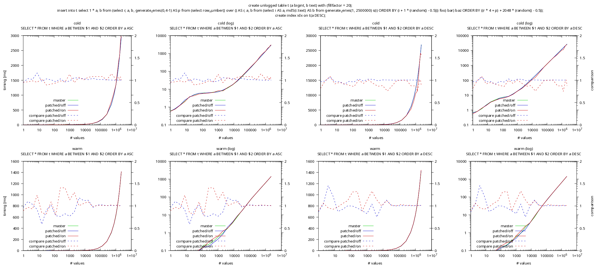
[pdf](pdf/2-io_uring.pdf)
[dataset](20251213-171700/datasets/2)
[Q1](20251213-171700/templates/5)
[Q2](20251213-171700/templates/6)
[Q3](20251213-171700/templates/7)
[Q4](20251213-171700/templates/6)
## 3
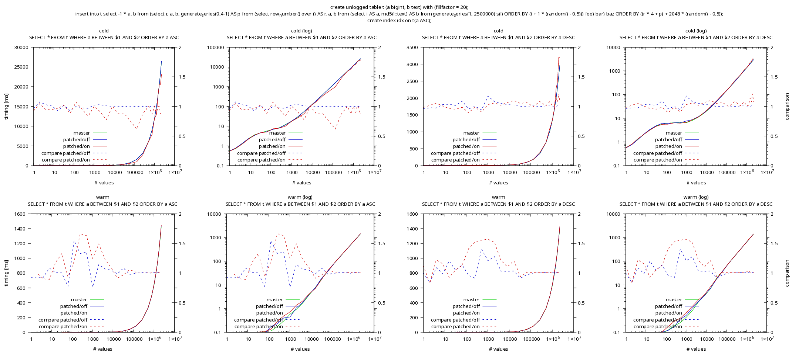
[pdf](pdf/3-io_uring.pdf)
[dataset](20251213-171700/datasets/3)
[Q1](20251213-171700/templates/11)
[Q2](20251213-171700/templates/12)
[Q3](20251213-171700/templates/11)
[Q4](20251213-171700/templates/10)
## 4
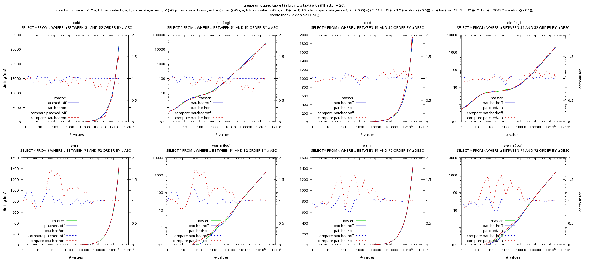
[pdf](pdf/4-io_uring.pdf)
[dataset](20251213-171700/datasets/4)
[Q1](20251213-171700/templates/13)
[Q2](20251213-171700/templates/16)
[Q3](20251213-171700/templates/13)
[Q4](20251213-171700/templates/16)
## 5
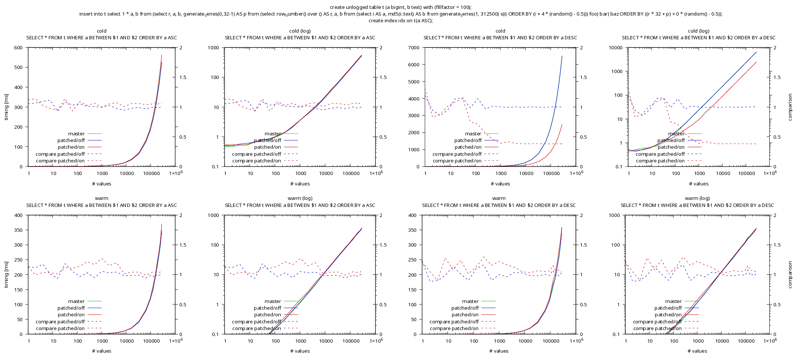
[pdf](pdf/5-io_uring.pdf)
[dataset](20251213-171700/datasets/5)
[Q1](20251213-171700/templates/19)
[Q2](20251213-171700/templates/20)
[Q3](20251213-171700/templates/17)
[Q4](20251213-171700/templates/20)
## 6
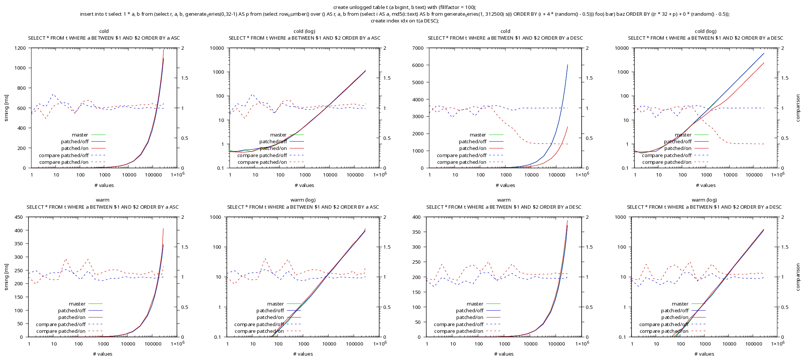
[pdf](pdf/6-io_uring.pdf)
[dataset](20251213-171700/datasets/6)
[Q1](20251213-171700/templates/21)
[Q2](20251213-171700/templates/22)
[Q3](20251213-171700/templates/21)
[Q4](20251213-171700/templates/22)
## 7
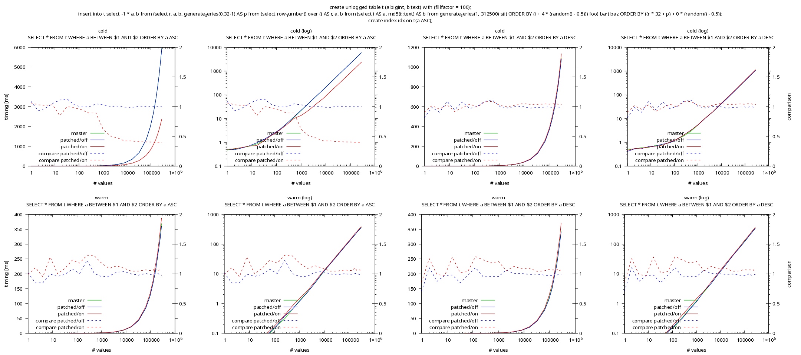
[pdf](pdf/7-io_uring.pdf)
[dataset](20251213-171700/datasets/7)
[Q1](20251213-171700/templates/27)
[Q2](20251213-171700/templates/28)
[Q3](20251213-171700/templates/27)
[Q4](20251213-171700/templates/26)
## 8
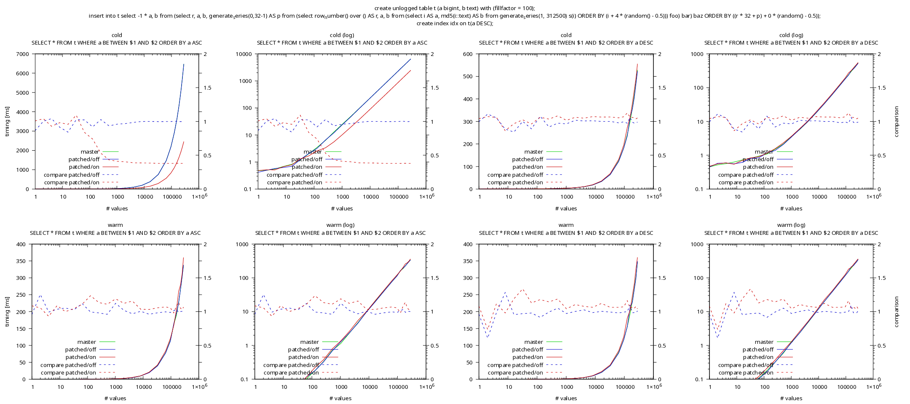
[pdf](pdf/8-io_uring.pdf)
[dataset](20251213-171700/datasets/8)
[Q1](20251213-171700/templates/29)
[Q2](20251213-171700/templates/32)
[Q3](20251213-171700/templates/29)
[Q4](20251213-171700/templates/32)
## 9

[pdf](pdf/9-io_uring.pdf)
[dataset](20251213-171700/datasets/9)
[Q1](20251213-171700/templates/35)
[Q2](20251213-171700/templates/34)
[Q3](20251213-171700/templates/33)
[Q4](20251213-171700/templates/36)
## 10
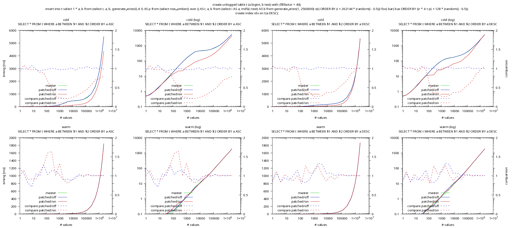
[pdf](pdf/10-io_uring.pdf)
[dataset](20251213-171700/datasets/10)
[Q1](20251213-171700/templates/39)
[Q2](20251213-171700/templates/38)
[Q3](20251213-171700/templates/39)
[Q4](20251213-171700/templates/40)
## 11
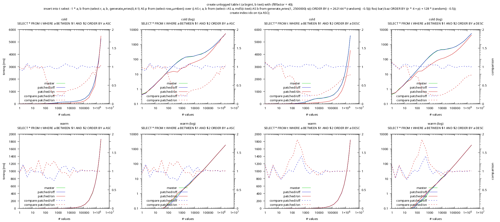
[pdf](pdf/11-io_uring.pdf)
[dataset](20251213-171700/datasets/11)
[Q1](20251213-171700/templates/43)
[Q2](20251213-171700/templates/42)
[Q3](20251213-171700/templates/41)
[Q4](20251213-171700/templates/42)
## 12
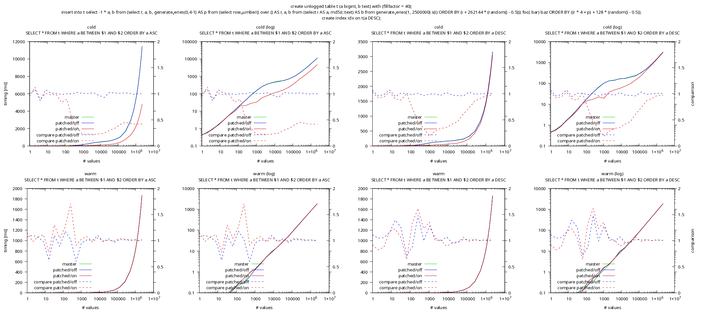
[pdf](pdf/12-io_uring.pdf)
[dataset](20251213-171700/datasets/12)
[Q1](20251213-171700/templates/45)
[Q2](20251213-171700/templates/46)
[Q3](20251213-171700/templates/45)
[Q4](20251213-171700/templates/46)
## 13
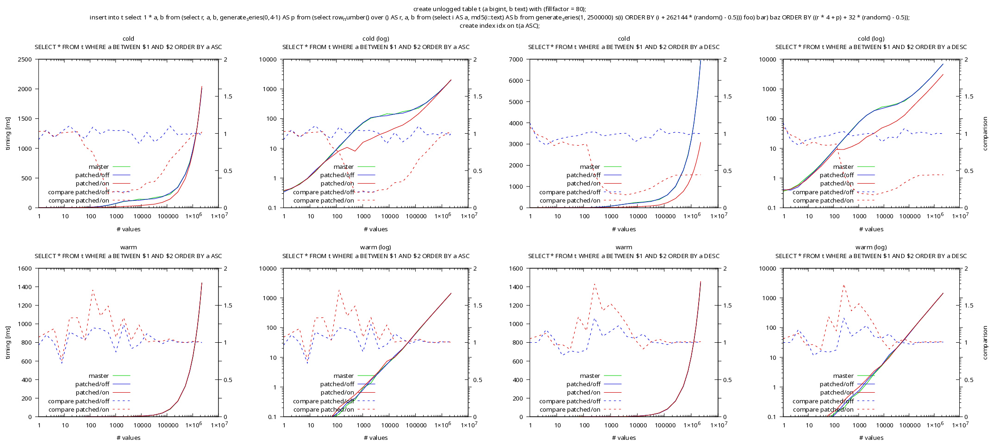
[pdf](pdf/13-io_uring.pdf)
[dataset](20251213-171700/datasets/13)
[Q1](20251213-171700/templates/49)
[Q2](20251213-171700/templates/50)
[Q3](20251213-171700/templates/51)
[Q4](20251213-171700/templates/50)
## 14
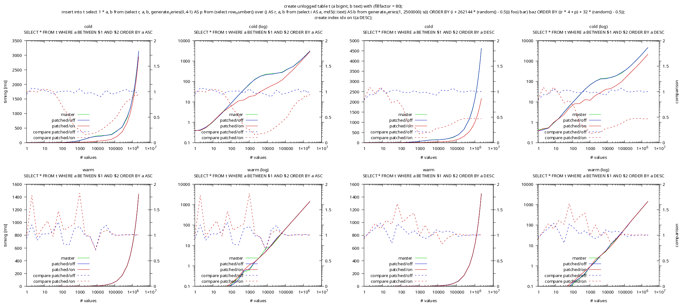
[pdf](pdf/14-io_uring.pdf)
[dataset](20251213-171700/datasets/14)
[Q1](20251213-171700/templates/55)
[Q2](20251213-171700/templates/56)
[Q3](20251213-171700/templates/55)
[Q4](20251213-171700/templates/56)
## 15
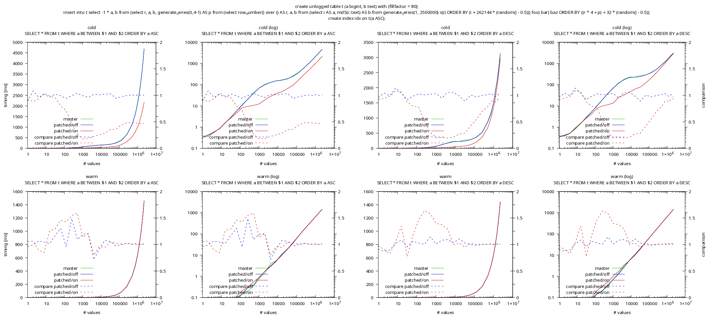
[pdf](pdf/15-io_uring.pdf)
[dataset](20251213-171700/datasets/15)
[Q1](20251213-171700/templates/57)
[Q2](20251213-171700/templates/58)
[Q3](20251213-171700/templates/57)
[Q4](20251213-171700/templates/58)
## 16
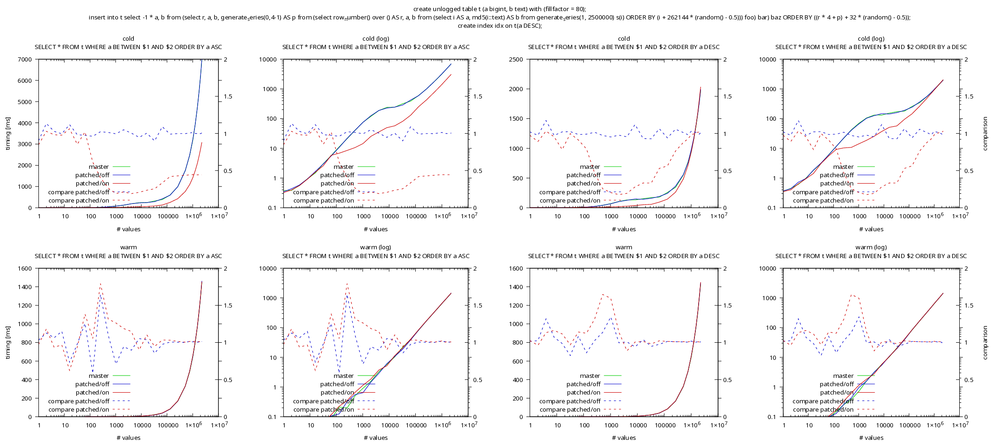
[pdf](pdf/16-io_uring.pdf)
[dataset](20251213-171700/datasets/16)
[Q1](20251213-171700/templates/61)
[Q2](20251213-171700/templates/62)
[Q3](20251213-171700/templates/61)
[Q4](20251213-171700/templates/62)
## 17
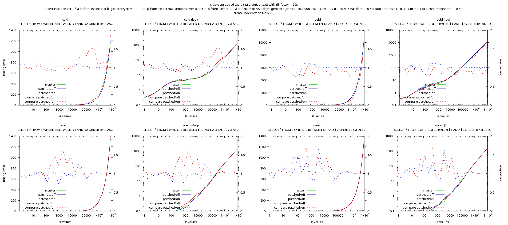
[pdf](pdf/17-io_uring.pdf)
[dataset](20251213-171700/datasets/17)
[Q1](20251213-171700/templates/65)
[Q2](20251213-171700/templates/66)
[Q3](20251213-171700/templates/65)
[Q4](20251213-171700/templates/68)
## 18
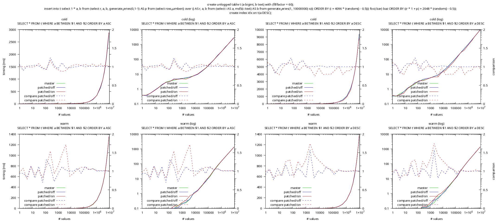
[pdf](pdf/18-io_uring.pdf)
[dataset](20251213-171700/datasets/18)
[Q1](20251213-171700/templates/71)
[Q2](20251213-171700/templates/72)
[Q3](20251213-171700/templates/69)
[Q4](20251213-171700/templates/70)
## 19
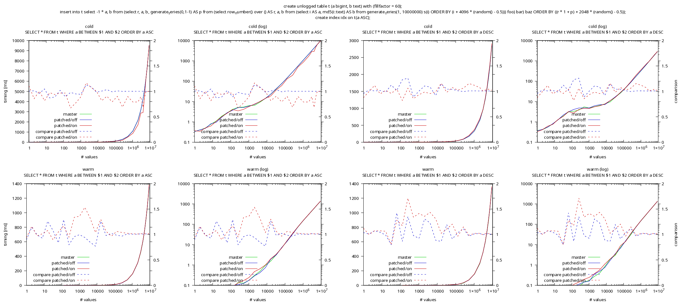
[pdf](pdf/19-io_uring.pdf)
[dataset](20251213-171700/datasets/19)
[Q1](20251213-171700/templates/75)
[Q2](20251213-171700/templates/76)
[Q3](20251213-171700/templates/75)
[Q4](20251213-171700/templates/76)
## 20
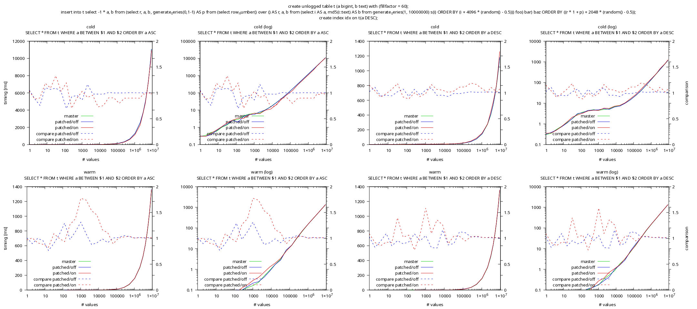
[pdf](pdf/20-io_uring.pdf)
[dataset](20251213-171700/datasets/20)
[Q1](20251213-171700/templates/79)
[Q2](20251213-171700/templates/78)
[Q3](20251213-171700/templates/77)
[Q4](20251213-171700/templates/80)
## 21
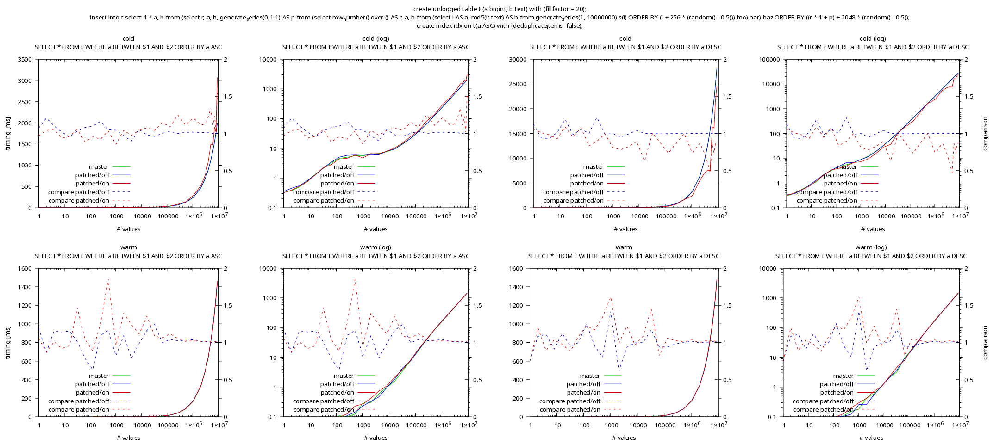
[pdf](pdf/21-io_uring.pdf)
[dataset](20251213-171700/datasets/21)
[Q1](20251213-171700/templates/81)
[Q2](20251213-171700/templates/82)
[Q3](20251213-171700/templates/83)
[Q4](20251213-171700/templates/84)
## 22

[pdf](pdf/22-io_uring.pdf)
[dataset](20251213-171700/datasets/22)
[Q1](20251213-171700/templates/87)
[Q2](20251213-171700/templates/88)
[Q3](20251213-171700/templates/87)
[Q4](20251213-171700/templates/88)
## 23
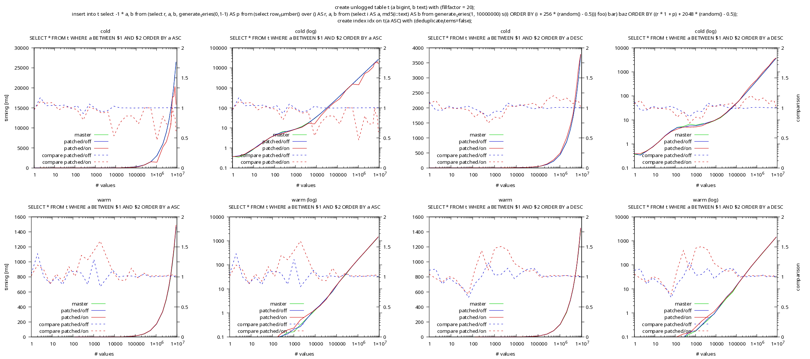
[pdf](pdf/23-io_uring.pdf)
[dataset](20251213-171700/datasets/23)
[Q1](20251213-171700/templates/89)
[Q2](20251213-171700/templates/90)
[Q3](20251213-171700/templates/89)
[Q4](20251213-171700/templates/92)
## 24
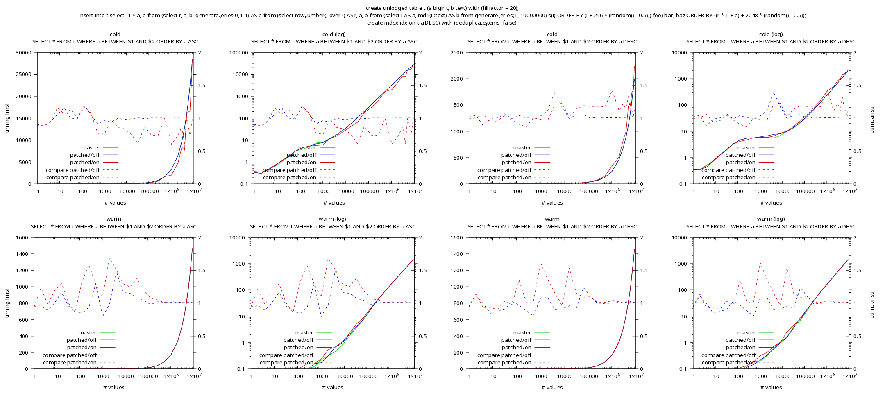
[pdf](pdf/24-io_uring.pdf)
[dataset](20251213-171700/datasets/24)
[Q1](20251213-171700/templates/95)
[Q2](20251213-171700/templates/96)
[Q3](20251213-171700/templates/95)
[Q4](20251213-171700/templates/94)
## 25
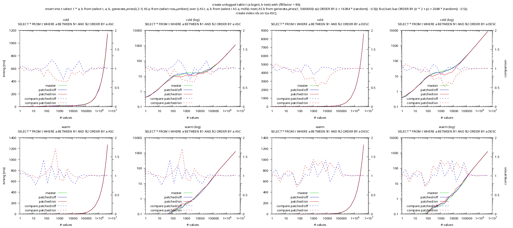
[pdf](pdf/25-io_uring.pdf)
[dataset](20251213-171700/datasets/25)
[Q1](20251213-171700/templates/97)
[Q2](20251213-171700/templates/100)
[Q3](20251213-171700/templates/99)
[Q4](20251213-171700/templates/100)
## 26
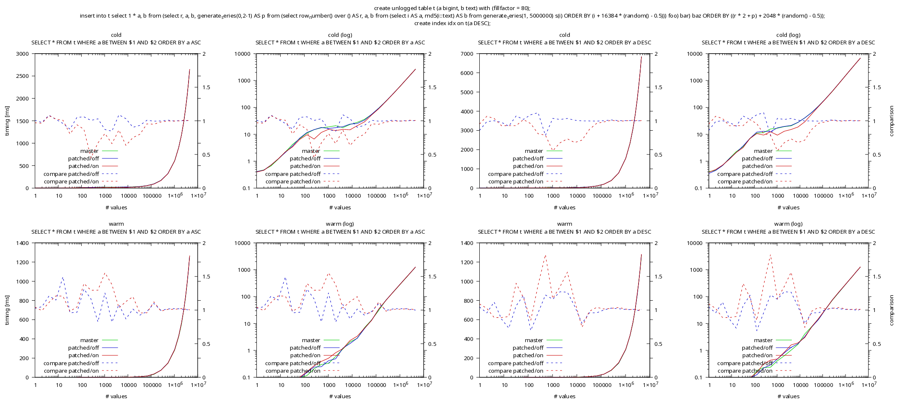
[pdf](pdf/26-io_uring.pdf)
[dataset](20251213-171700/datasets/26)
[Q1](20251213-171700/templates/103)
[Q2](20251213-171700/templates/104)
[Q3](20251213-171700/templates/103)
[Q4](20251213-171700/templates/104)
## 27
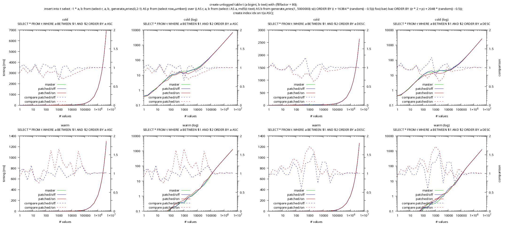
[pdf](pdf/27-io_uring.pdf)
[dataset](20251213-171700/datasets/27)
[Q1](20251213-171700/templates/107)
[Q2](20251213-171700/templates/106)
[Q3](20251213-171700/templates/107)
[Q4](20251213-171700/templates/108)
## 28
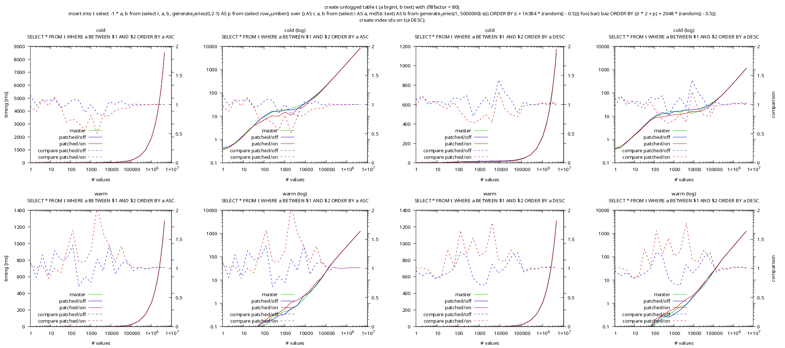
[pdf](pdf/28-io_uring.pdf)
[dataset](20251213-171700/datasets/28)
[Q1](20251213-171700/templates/111)
[Q2](20251213-171700/templates/110)
[Q3](20251213-171700/templates/109)
[Q4](20251213-171700/templates/110)
## 29
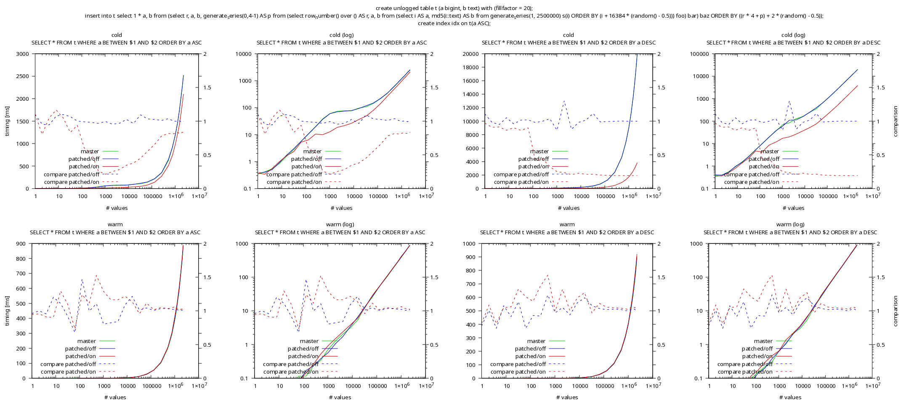
[pdf](pdf/29-io_uring.pdf)
[dataset](20251213-171700/datasets/29)
[Q1](20251213-171700/templates/113)
[Q2](20251213-171700/templates/114)
[Q3](20251213-171700/templates/115)
[Q4](20251213-171700/templates/116)
## 30
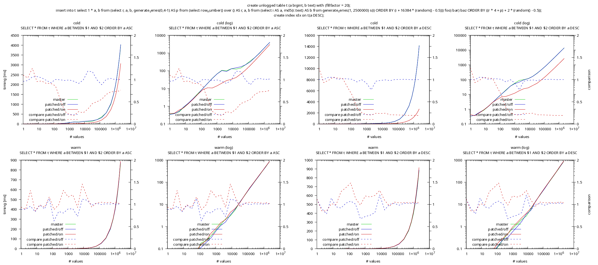
[pdf](pdf/30-io_uring.pdf)
[dataset](20251213-171700/datasets/30)
[Q1](20251213-171700/templates/117)
[Q2](20251213-171700/templates/118)
[Q3](20251213-171700/templates/119)
[Q4](20251213-171700/templates/120)
## 31
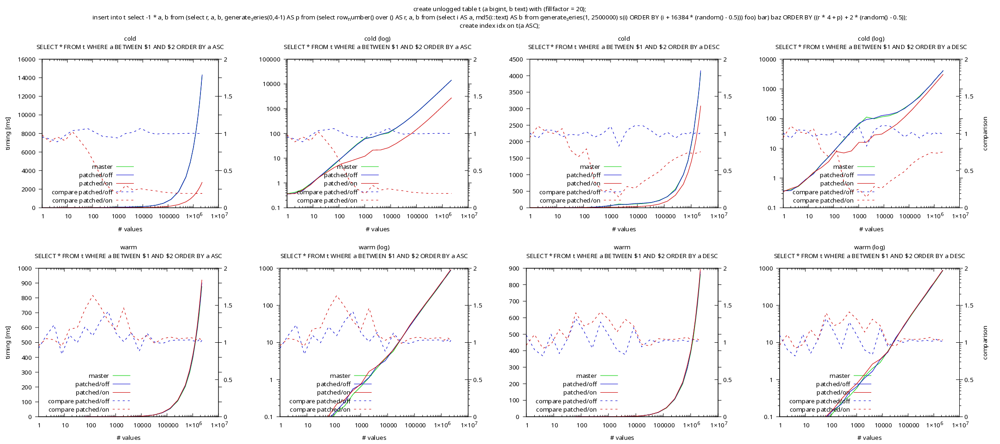
[pdf](pdf/31-io_uring.pdf)
[dataset](20251213-171700/datasets/31)
[Q1](20251213-171700/templates/123)
[Q2](20251213-171700/templates/122)
[Q3](20251213-171700/templates/123)
[Q4](20251213-171700/templates/122)
## 32
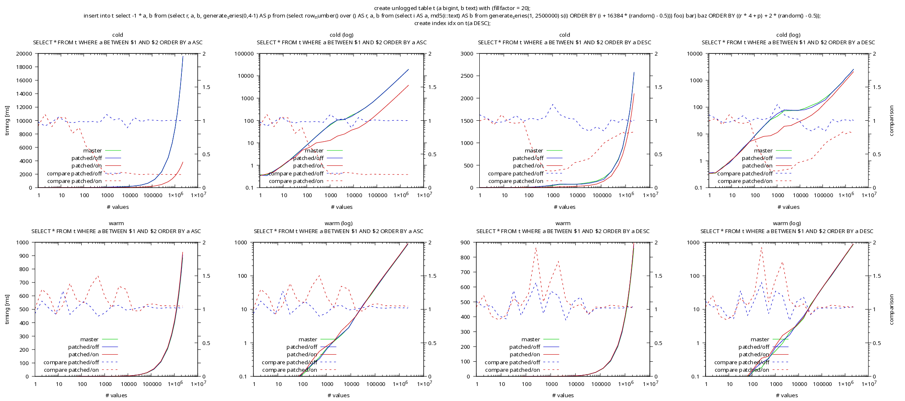
[pdf](pdf/32-io_uring.pdf)
[dataset](20251213-171700/datasets/32)
[Q1](20251213-171700/templates/127)
[Q2](20251213-171700/templates/128)
[Q3](20251213-171700/templates/127)
[Q4](20251213-171700/templates/128)
## 33
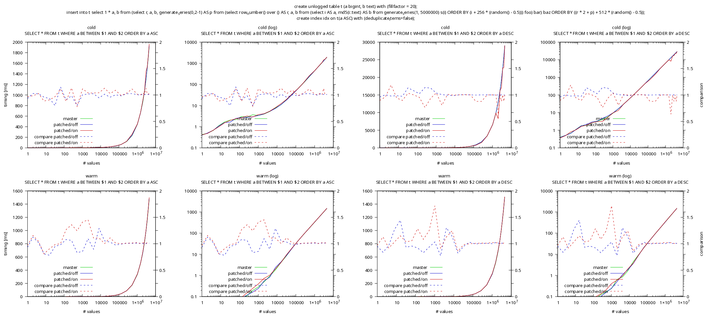
[pdf](pdf/33-io_uring.pdf)
[dataset](20251213-171700/datasets/33)
[Q1](20251213-171700/templates/129)
[Q2](20251213-171700/templates/132)
[Q3](20251213-171700/templates/131)
[Q4](20251213-171700/templates/130)
## 34
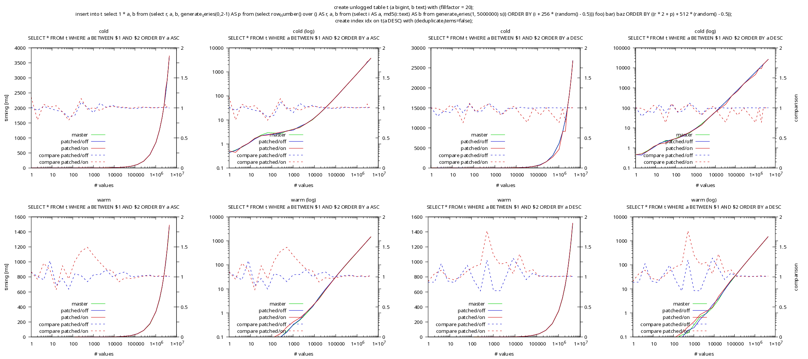
[pdf](pdf/34-io_uring.pdf)
[dataset](20251213-171700/datasets/34)
[Q1](20251213-171700/templates/133)
[Q2](20251213-171700/templates/134)
[Q3](20251213-171700/templates/133)
[Q4](20251213-171700/templates/134)
## 35
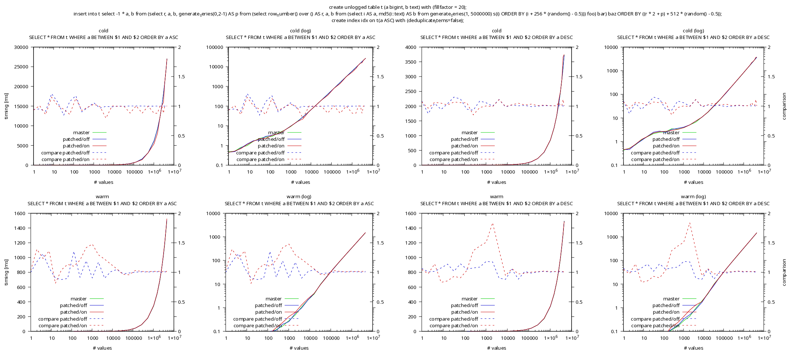
[pdf](pdf/35-io_uring.pdf)
[dataset](20251213-171700/datasets/35)
[Q1](20251213-171700/templates/139)
[Q2](20251213-171700/templates/140)
[Q3](20251213-171700/templates/137)
[Q4](20251213-171700/templates/140)
## 36
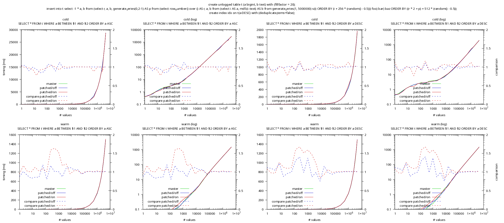
[pdf](pdf/36-io_uring.pdf)
[dataset](20251213-171700/datasets/36)
[Q1](20251213-171700/templates/141)
[Q2](20251213-171700/templates/144)
[Q3](20251213-171700/templates/141)
[Q4](20251213-171700/templates/144)
## 37
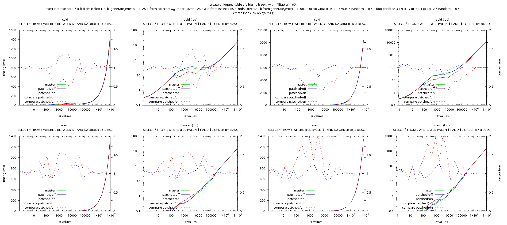
[pdf](pdf/37-io_uring.pdf)
[dataset](20251213-171700/datasets/37)
[Q1](20251213-171700/templates/145)
[Q2](20251213-171700/templates/148)
[Q3](20251213-171700/templates/145)
[Q4](20251213-171700/templates/146)
## 38
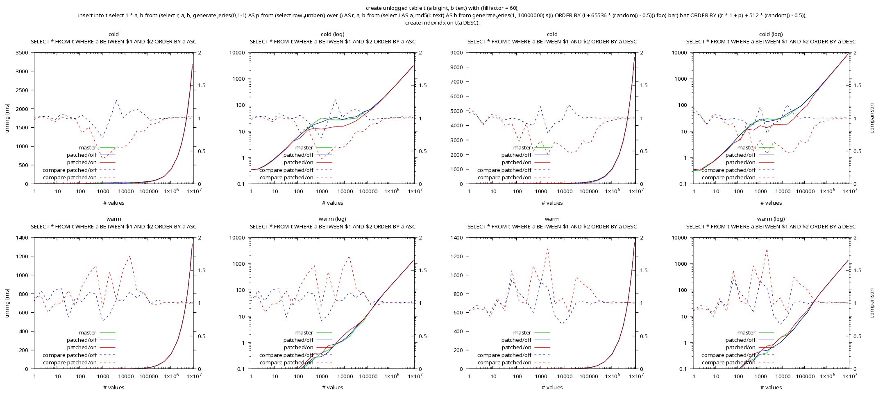
[pdf](pdf/38-io_uring.pdf)
[dataset](20251213-171700/datasets/38)
[Q1](20251213-171700/templates/149)
[Q2](20251213-171700/templates/150)
[Q3](20251213-171700/templates/151)
[Q4](20251213-171700/templates/152)
## 39
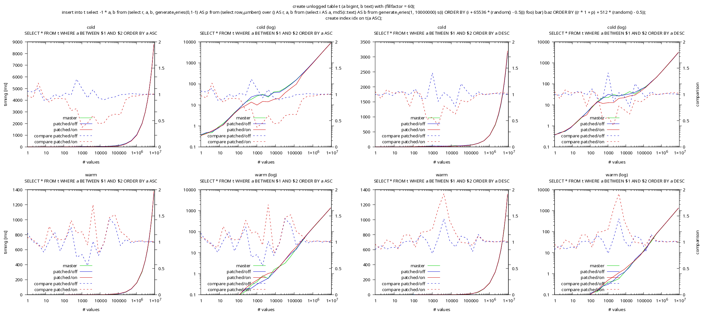
[pdf](pdf/39-io_uring.pdf)
[dataset](20251213-171700/datasets/39)
[Q1](20251213-171700/templates/155)
[Q2](20251213-171700/templates/154)
[Q3](20251213-171700/templates/153)
[Q4](20251213-171700/templates/156)
## 40
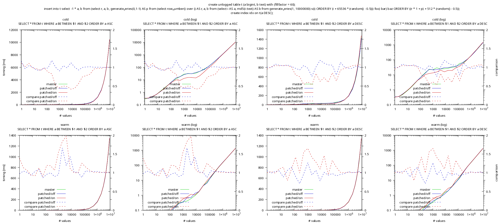
[pdf](pdf/40-io_uring.pdf)
[dataset](20251213-171700/datasets/40)
[Q1](20251213-171700/templates/159)
[Q2](20251213-171700/templates/158)
[Q3](20251213-171700/templates/159)
[Q4](20251213-171700/templates/158)
## 41
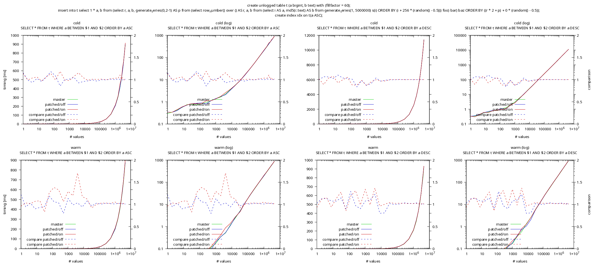
[pdf](pdf/41-io_uring.pdf)
[dataset](20251213-171700/datasets/41)
[Q1](20251213-171700/templates/163)
[Q2](20251213-171700/templates/162)
[Q3](20251213-171700/templates/161)
[Q4](20251213-171700/templates/164)
## 42
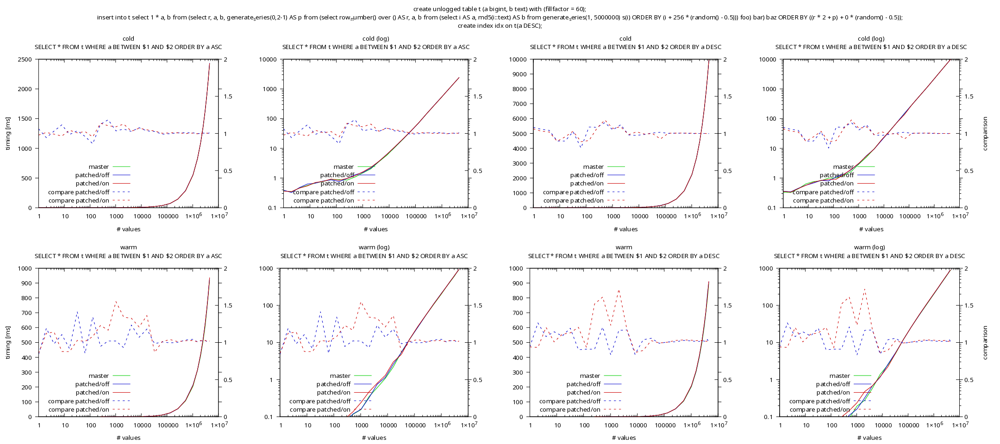
[pdf](pdf/42-io_uring.pdf)
[dataset](20251213-171700/datasets/42)
[Q1](20251213-171700/templates/167)
[Q2](20251213-171700/templates/166)
[Q3](20251213-171700/templates/167)
[Q4](20251213-171700/templates/166)
## 43
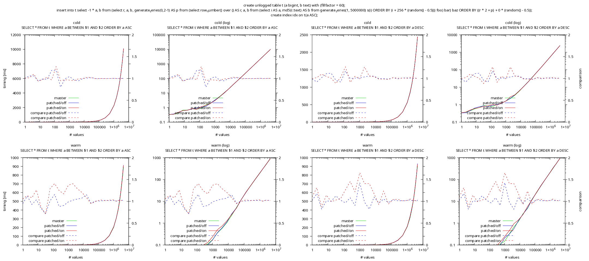
[pdf](pdf/43-io_uring.pdf)
[dataset](20251213-171700/datasets/43)
[Q1](20251213-171700/templates/171)
[Q2](20251213-171700/templates/172)
[Q3](20251213-171700/templates/171)
[Q4](20251213-171700/templates/172)
## 44
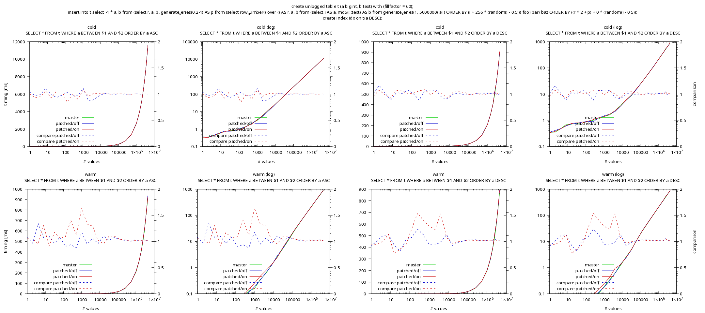
[pdf](pdf/44-io_uring.pdf)
[dataset](20251213-171700/datasets/44)
[Q1](20251213-171700/templates/175)
[Q2](20251213-171700/templates/174)
[Q3](20251213-171700/templates/175)
[Q4](20251213-171700/templates/176)
## 45
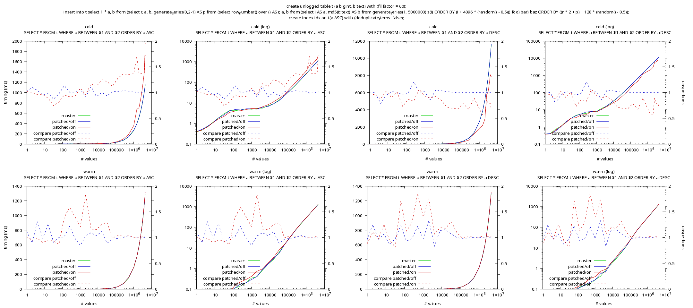
[pdf](pdf/45-io_uring.pdf)
[dataset](20251213-171700/datasets/45)
[Q1](20251213-171700/templates/177)
[Q2](20251213-171700/templates/180)
[Q3](20251213-171700/templates/179)
[Q4](20251213-171700/templates/178)
## 46
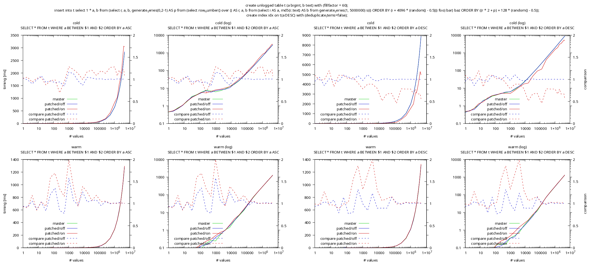
[pdf](pdf/46-io_uring.pdf)
[dataset](20251213-171700/datasets/46)
[Q1](20251213-171700/templates/183)
[Q2](20251213-171700/templates/184)
[Q3](20251213-171700/templates/183)
[Q4](20251213-171700/templates/184)
