## 1
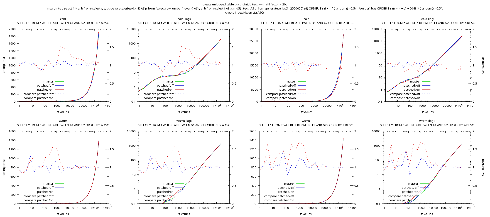
[pdf](pdf/1-worker.pdf)
[dataset](20251213-171700/datasets/1)
[Q1](20251213-171700/templates/SELECT * FROM t WHERE a BETWEEN $1 AND $2 ORDER BY a ASC)
[Q2](20251213-171700/templates/SELECT * FROM t WHERE a BETWEEN $1 AND $2 ORDER BY a DESC)
[Q3](20251213-171700/templates/SELECT * FROM t WHERE a BETWEEN $1 AND $2 ORDER BY a ASC)
[Q4](20251213-171700/templates/SELECT * FROM t WHERE a BETWEEN $1 AND $2 ORDER BY a DESC)
## 2
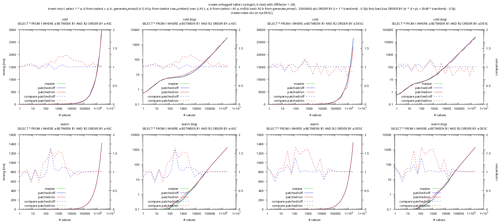
[pdf](pdf/2-worker.pdf)
[dataset](20251213-171700/datasets/2)
[Q1](20251213-171700/templates/SELECT * FROM t WHERE a BETWEEN $1 AND $2 ORDER BY a ASC)
[Q2](20251213-171700/templates/SELECT * FROM t WHERE a BETWEEN $1 AND $2 ORDER BY a DESC)
[Q3](20251213-171700/templates/SELECT * FROM t WHERE a BETWEEN $1 AND $2 ORDER BY a ASC)
[Q4](20251213-171700/templates/SELECT * FROM t WHERE a BETWEEN $1 AND $2 ORDER BY a DESC)
## 3
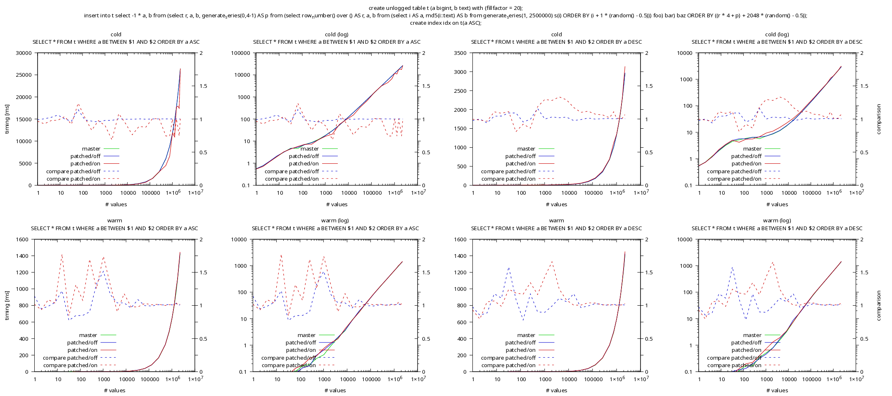
[pdf](pdf/3-worker.pdf)
[dataset](20251213-171700/datasets/3)
[Q1](20251213-171700/templates/SELECT * FROM t WHERE a BETWEEN $1 AND $2 ORDER BY a ASC)
[Q2](20251213-171700/templates/SELECT * FROM t WHERE a BETWEEN $1 AND $2 ORDER BY a DESC)
[Q3](20251213-171700/templates/SELECT * FROM t WHERE a BETWEEN $1 AND $2 ORDER BY a ASC)
[Q4](20251213-171700/templates/SELECT * FROM t WHERE a BETWEEN $1 AND $2 ORDER BY a DESC)
## 4
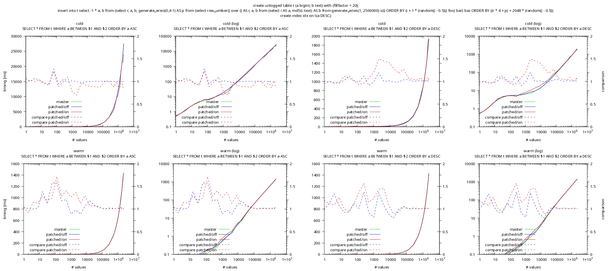
[pdf](pdf/4-worker.pdf)
[dataset](20251213-171700/datasets/4)
[Q1](20251213-171700/templates/SELECT * FROM t WHERE a BETWEEN $1 AND $2 ORDER BY a ASC)
[Q2](20251213-171700/templates/SELECT * FROM t WHERE a BETWEEN $1 AND $2 ORDER BY a DESC)
[Q3](20251213-171700/templates/SELECT * FROM t WHERE a BETWEEN $1 AND $2 ORDER BY a ASC)
[Q4](20251213-171700/templates/SELECT * FROM t WHERE a BETWEEN $1 AND $2 ORDER BY a DESC)
## 5
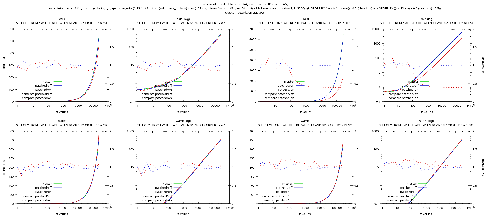
[pdf](pdf/5-worker.pdf)
[dataset](20251213-171700/datasets/5)
[Q1](20251213-171700/templates/SELECT * FROM t WHERE a BETWEEN $1 AND $2 ORDER BY a ASC)
[Q2](20251213-171700/templates/SELECT * FROM t WHERE a BETWEEN $1 AND $2 ORDER BY a DESC)
[Q3](20251213-171700/templates/SELECT * FROM t WHERE a BETWEEN $1 AND $2 ORDER BY a ASC)
[Q4](20251213-171700/templates/SELECT * FROM t WHERE a BETWEEN $1 AND $2 ORDER BY a DESC)
## 6
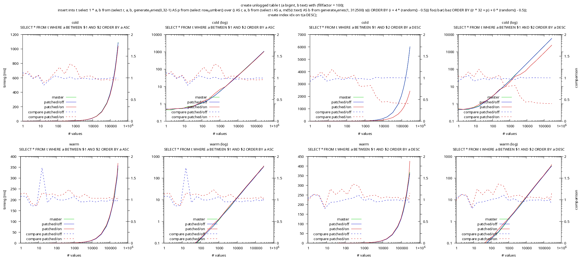
[pdf](pdf/6-worker.pdf)
[dataset](20251213-171700/datasets/6)
[Q1](20251213-171700/templates/SELECT * FROM t WHERE a BETWEEN $1 AND $2 ORDER BY a ASC)
[Q2](20251213-171700/templates/SELECT * FROM t WHERE a BETWEEN $1 AND $2 ORDER BY a DESC)
[Q3](20251213-171700/templates/SELECT * FROM t WHERE a BETWEEN $1 AND $2 ORDER BY a ASC)
[Q4](20251213-171700/templates/SELECT * FROM t WHERE a BETWEEN $1 AND $2 ORDER BY a DESC)
## 7
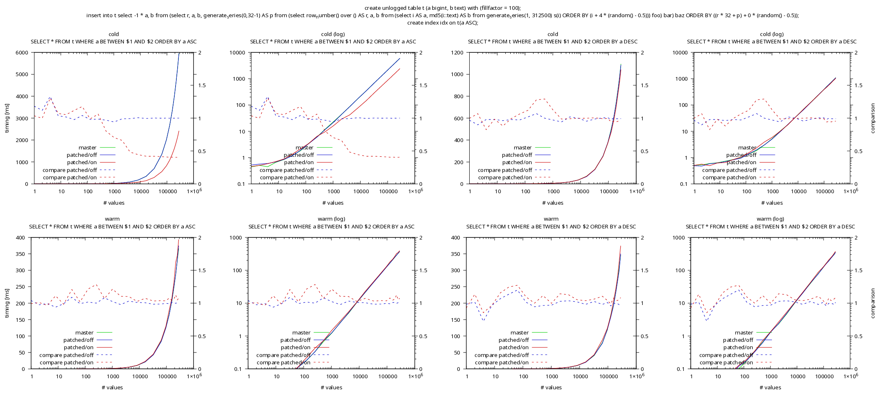
[pdf](pdf/7-worker.pdf)
[dataset](20251213-171700/datasets/7)
[Q1](20251213-171700/templates/SELECT * FROM t WHERE a BETWEEN $1 AND $2 ORDER BY a ASC)
[Q2](20251213-171700/templates/SELECT * FROM t WHERE a BETWEEN $1 AND $2 ORDER BY a DESC)
[Q3](20251213-171700/templates/SELECT * FROM t WHERE a BETWEEN $1 AND $2 ORDER BY a ASC)
[Q4](20251213-171700/templates/SELECT * FROM t WHERE a BETWEEN $1 AND $2 ORDER BY a DESC)
## 8
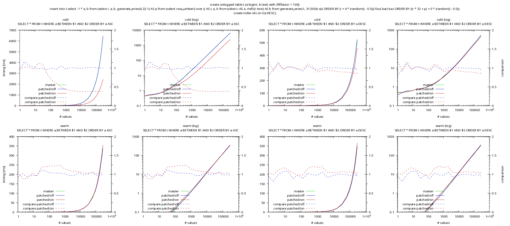
[pdf](pdf/8-worker.pdf)
[dataset](20251213-171700/datasets/8)
[Q1](20251213-171700/templates/SELECT * FROM t WHERE a BETWEEN $1 AND $2 ORDER BY a ASC)
[Q2](20251213-171700/templates/SELECT * FROM t WHERE a BETWEEN $1 AND $2 ORDER BY a DESC)
[Q3](20251213-171700/templates/SELECT * FROM t WHERE a BETWEEN $1 AND $2 ORDER BY a ASC)
[Q4](20251213-171700/templates/SELECT * FROM t WHERE a BETWEEN $1 AND $2 ORDER BY a DESC)
## 9
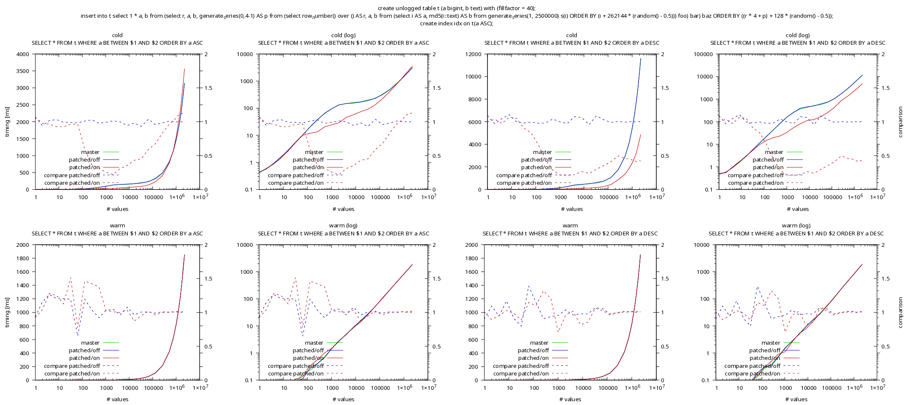
[pdf](pdf/9-worker.pdf)
[dataset](20251213-171700/datasets/9)
[Q1](20251213-171700/templates/SELECT * FROM t WHERE a BETWEEN $1 AND $2 ORDER BY a ASC)
[Q2](20251213-171700/templates/SELECT * FROM t WHERE a BETWEEN $1 AND $2 ORDER BY a DESC)
[Q3](20251213-171700/templates/SELECT * FROM t WHERE a BETWEEN $1 AND $2 ORDER BY a ASC)
[Q4](20251213-171700/templates/SELECT * FROM t WHERE a BETWEEN $1 AND $2 ORDER BY a DESC)
## 10
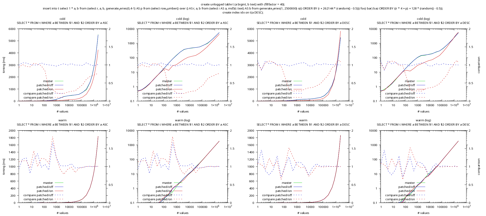
[pdf](pdf/10-worker.pdf)
[dataset](20251213-171700/datasets/10)
[Q1](20251213-171700/templates/SELECT * FROM t WHERE a BETWEEN $1 AND $2 ORDER BY a ASC)
[Q2](20251213-171700/templates/SELECT * FROM t WHERE a BETWEEN $1 AND $2 ORDER BY a DESC)
[Q3](20251213-171700/templates/SELECT * FROM t WHERE a BETWEEN $1 AND $2 ORDER BY a ASC)
[Q4](20251213-171700/templates/SELECT * FROM t WHERE a BETWEEN $1 AND $2 ORDER BY a DESC)
## 11
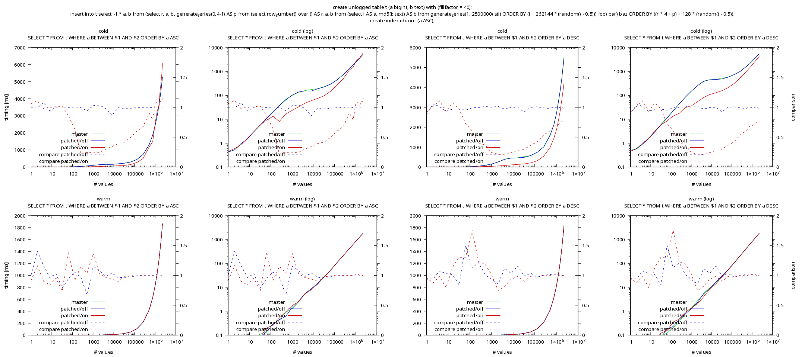
[pdf](pdf/11-worker.pdf)
[dataset](20251213-171700/datasets/11)
[Q1](20251213-171700/templates/SELECT * FROM t WHERE a BETWEEN $1 AND $2 ORDER BY a ASC)
[Q2](20251213-171700/templates/SELECT * FROM t WHERE a BETWEEN $1 AND $2 ORDER BY a DESC)
[Q3](20251213-171700/templates/SELECT * FROM t WHERE a BETWEEN $1 AND $2 ORDER BY a ASC)
[Q4](20251213-171700/templates/SELECT * FROM t WHERE a BETWEEN $1 AND $2 ORDER BY a DESC)
## 12
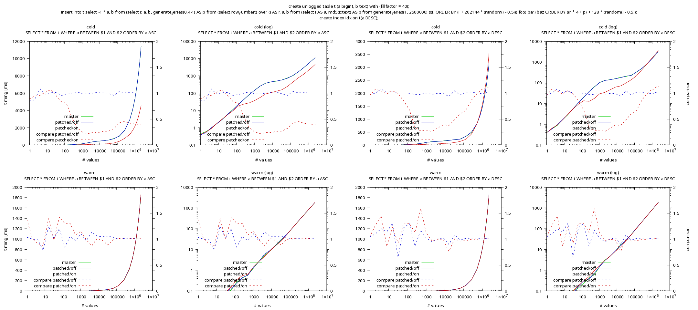
[pdf](pdf/12-worker.pdf)
[dataset](20251213-171700/datasets/12)
[Q1](20251213-171700/templates/SELECT * FROM t WHERE a BETWEEN $1 AND $2 ORDER BY a ASC)
[Q2](20251213-171700/templates/SELECT * FROM t WHERE a BETWEEN $1 AND $2 ORDER BY a DESC)
[Q3](20251213-171700/templates/SELECT * FROM t WHERE a BETWEEN $1 AND $2 ORDER BY a ASC)
[Q4](20251213-171700/templates/SELECT * FROM t WHERE a BETWEEN $1 AND $2 ORDER BY a DESC)
## 13
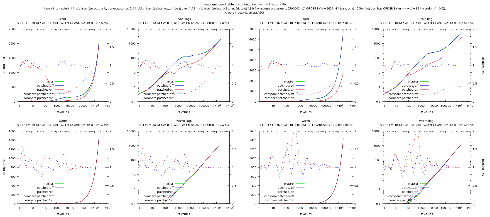
[pdf](pdf/13-worker.pdf)
[dataset](20251213-171700/datasets/13)
[Q1](20251213-171700/templates/SELECT * FROM t WHERE a BETWEEN $1 AND $2 ORDER BY a ASC)
[Q2](20251213-171700/templates/SELECT * FROM t WHERE a BETWEEN $1 AND $2 ORDER BY a DESC)
[Q3](20251213-171700/templates/SELECT * FROM t WHERE a BETWEEN $1 AND $2 ORDER BY a ASC)
[Q4](20251213-171700/templates/SELECT * FROM t WHERE a BETWEEN $1 AND $2 ORDER BY a DESC)
## 14
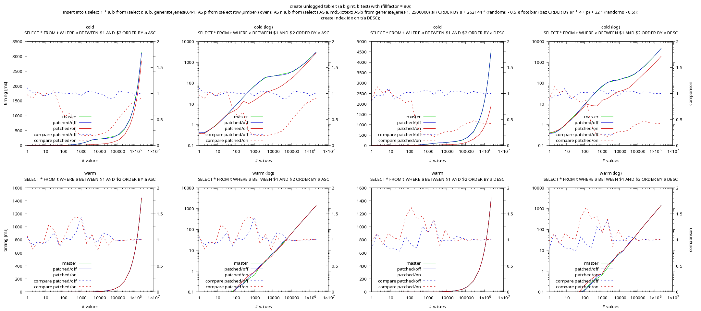
[pdf](pdf/14-worker.pdf)
[dataset](20251213-171700/datasets/14)
[Q1](20251213-171700/templates/SELECT * FROM t WHERE a BETWEEN $1 AND $2 ORDER BY a ASC)
[Q2](20251213-171700/templates/SELECT * FROM t WHERE a BETWEEN $1 AND $2 ORDER BY a DESC)
[Q3](20251213-171700/templates/SELECT * FROM t WHERE a BETWEEN $1 AND $2 ORDER BY a ASC)
[Q4](20251213-171700/templates/SELECT * FROM t WHERE a BETWEEN $1 AND $2 ORDER BY a DESC)
## 15
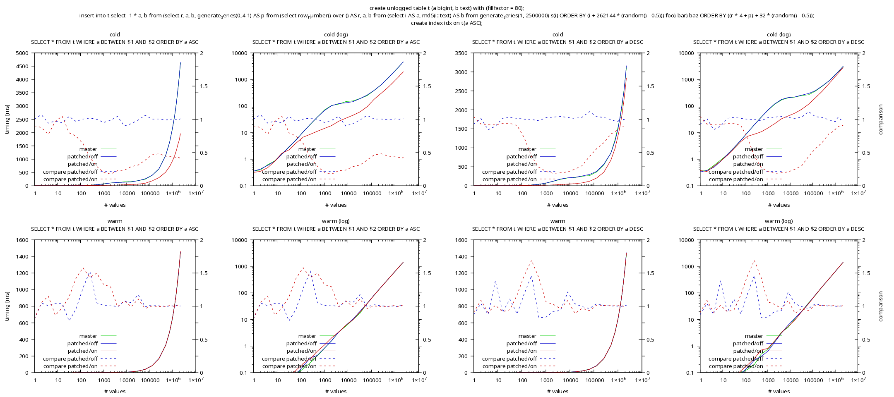
[pdf](pdf/15-worker.pdf)
[dataset](20251213-171700/datasets/15)
[Q1](20251213-171700/templates/SELECT * FROM t WHERE a BETWEEN $1 AND $2 ORDER BY a ASC)
[Q2](20251213-171700/templates/SELECT * FROM t WHERE a BETWEEN $1 AND $2 ORDER BY a DESC)
[Q3](20251213-171700/templates/SELECT * FROM t WHERE a BETWEEN $1 AND $2 ORDER BY a ASC)
[Q4](20251213-171700/templates/SELECT * FROM t WHERE a BETWEEN $1 AND $2 ORDER BY a DESC)
## 16
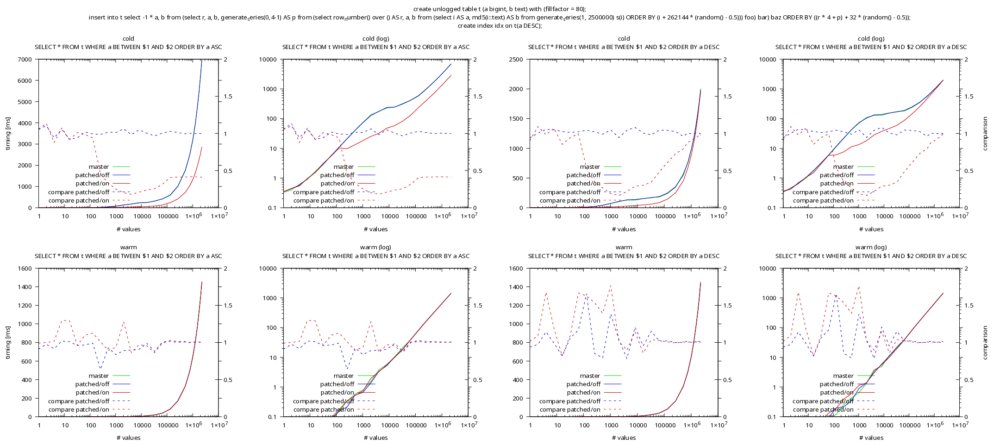
[pdf](pdf/16-worker.pdf)
[dataset](20251213-171700/datasets/16)
[Q1](20251213-171700/templates/SELECT * FROM t WHERE a BETWEEN $1 AND $2 ORDER BY a ASC)
[Q2](20251213-171700/templates/SELECT * FROM t WHERE a BETWEEN $1 AND $2 ORDER BY a DESC)
[Q3](20251213-171700/templates/SELECT * FROM t WHERE a BETWEEN $1 AND $2 ORDER BY a ASC)
[Q4](20251213-171700/templates/SELECT * FROM t WHERE a BETWEEN $1 AND $2 ORDER BY a DESC)
## 17
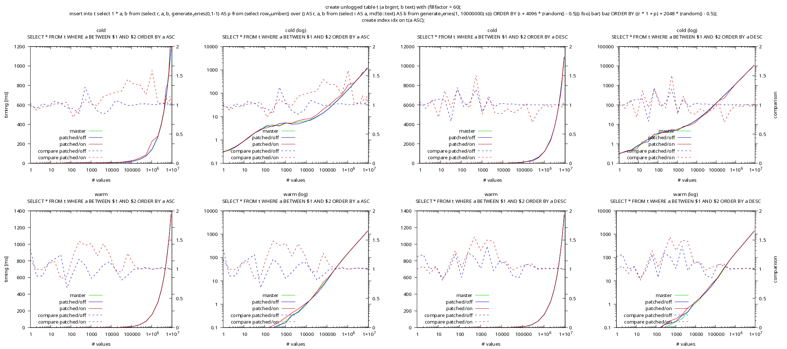
[pdf](pdf/17-worker.pdf)
[dataset](20251213-171700/datasets/17)
[Q1](20251213-171700/templates/SELECT * FROM t WHERE a BETWEEN $1 AND $2 ORDER BY a ASC)
[Q2](20251213-171700/templates/SELECT * FROM t WHERE a BETWEEN $1 AND $2 ORDER BY a DESC)
[Q3](20251213-171700/templates/SELECT * FROM t WHERE a BETWEEN $1 AND $2 ORDER BY a ASC)
[Q4](20251213-171700/templates/SELECT * FROM t WHERE a BETWEEN $1 AND $2 ORDER BY a DESC)
## 18
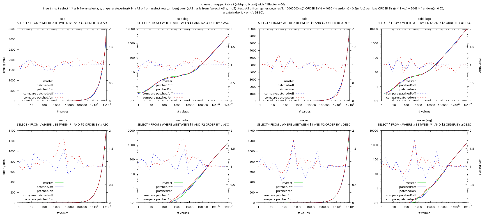
[pdf](pdf/18-worker.pdf)
[dataset](20251213-171700/datasets/18)
[Q1](20251213-171700/templates/SELECT * FROM t WHERE a BETWEEN $1 AND $2 ORDER BY a ASC)
[Q2](20251213-171700/templates/SELECT * FROM t WHERE a BETWEEN $1 AND $2 ORDER BY a DESC)
[Q3](20251213-171700/templates/SELECT * FROM t WHERE a BETWEEN $1 AND $2 ORDER BY a ASC)
[Q4](20251213-171700/templates/SELECT * FROM t WHERE a BETWEEN $1 AND $2 ORDER BY a DESC)
## 19
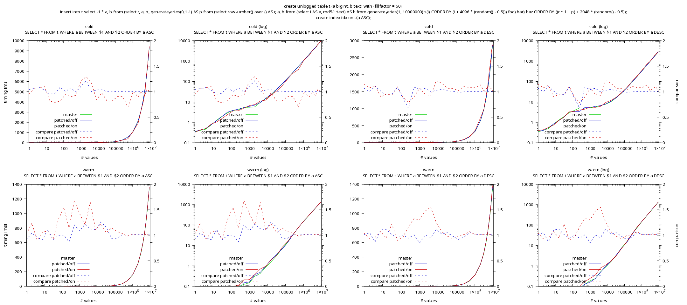
[pdf](pdf/19-worker.pdf)
[dataset](20251213-171700/datasets/19)
[Q1](20251213-171700/templates/SELECT * FROM t WHERE a BETWEEN $1 AND $2 ORDER BY a ASC)
[Q2](20251213-171700/templates/SELECT * FROM t WHERE a BETWEEN $1 AND $2 ORDER BY a DESC)
[Q3](20251213-171700/templates/SELECT * FROM t WHERE a BETWEEN $1 AND $2 ORDER BY a ASC)
[Q4](20251213-171700/templates/SELECT * FROM t WHERE a BETWEEN $1 AND $2 ORDER BY a DESC)
## 20

[pdf](pdf/20-worker.pdf)
[dataset](20251213-171700/datasets/20)
[Q1](20251213-171700/templates/SELECT * FROM t WHERE a BETWEEN $1 AND $2 ORDER BY a ASC)
[Q2](20251213-171700/templates/SELECT * FROM t WHERE a BETWEEN $1 AND $2 ORDER BY a DESC)
[Q3](20251213-171700/templates/SELECT * FROM t WHERE a BETWEEN $1 AND $2 ORDER BY a ASC)
[Q4](20251213-171700/templates/SELECT * FROM t WHERE a BETWEEN $1 AND $2 ORDER BY a DESC)
## 21
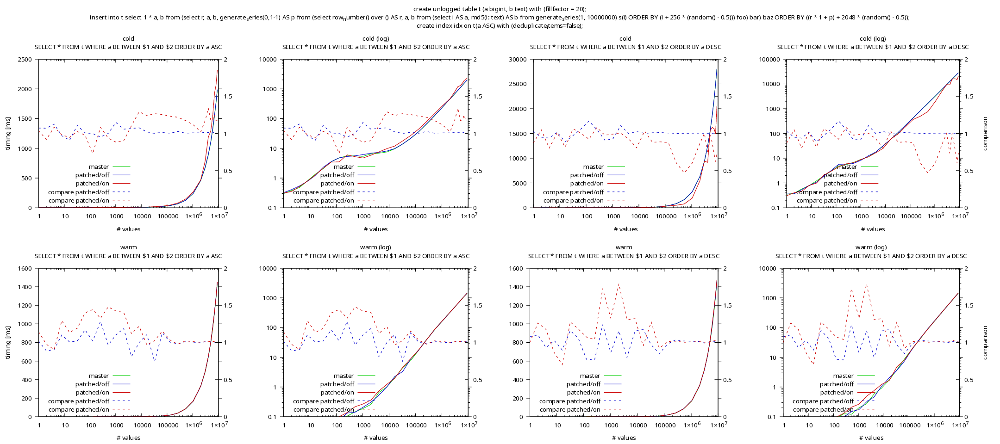
[pdf](pdf/21-worker.pdf)
[dataset](20251213-171700/datasets/21)
[Q1](20251213-171700/templates/SELECT * FROM t WHERE a BETWEEN $1 AND $2 ORDER BY a ASC)
[Q2](20251213-171700/templates/SELECT * FROM t WHERE a BETWEEN $1 AND $2 ORDER BY a DESC)
[Q3](20251213-171700/templates/SELECT * FROM t WHERE a BETWEEN $1 AND $2 ORDER BY a ASC)
[Q4](20251213-171700/templates/SELECT * FROM t WHERE a BETWEEN $1 AND $2 ORDER BY a DESC)
## 22
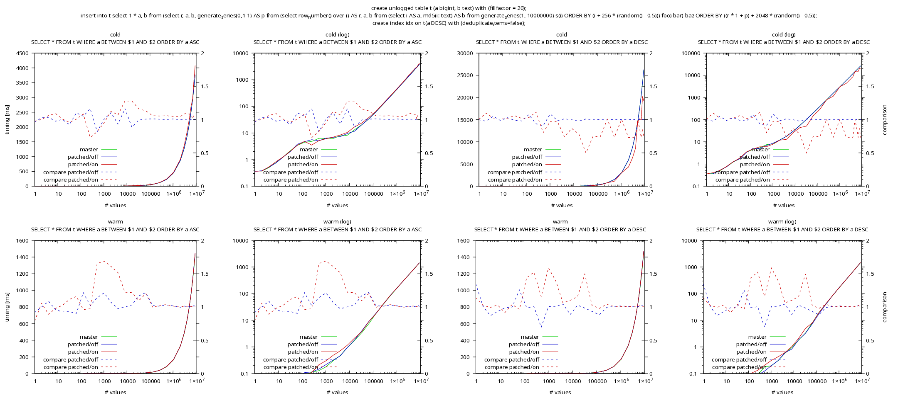
[pdf](pdf/22-worker.pdf)
[dataset](20251213-171700/datasets/22)
[Q1](20251213-171700/templates/SELECT * FROM t WHERE a BETWEEN $1 AND $2 ORDER BY a ASC)
[Q2](20251213-171700/templates/SELECT * FROM t WHERE a BETWEEN $1 AND $2 ORDER BY a DESC)
[Q3](20251213-171700/templates/SELECT * FROM t WHERE a BETWEEN $1 AND $2 ORDER BY a ASC)
[Q4](20251213-171700/templates/SELECT * FROM t WHERE a BETWEEN $1 AND $2 ORDER BY a DESC)
## 23
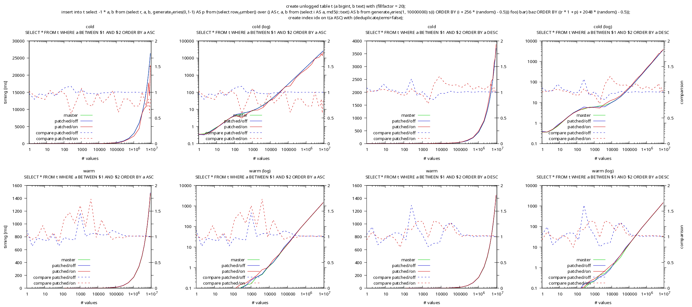
[pdf](pdf/23-worker.pdf)
[dataset](20251213-171700/datasets/23)
[Q1](20251213-171700/templates/SELECT * FROM t WHERE a BETWEEN $1 AND $2 ORDER BY a ASC)
[Q2](20251213-171700/templates/SELECT * FROM t WHERE a BETWEEN $1 AND $2 ORDER BY a DESC)
[Q3](20251213-171700/templates/SELECT * FROM t WHERE a BETWEEN $1 AND $2 ORDER BY a ASC)
[Q4](20251213-171700/templates/SELECT * FROM t WHERE a BETWEEN $1 AND $2 ORDER BY a DESC)
## 24
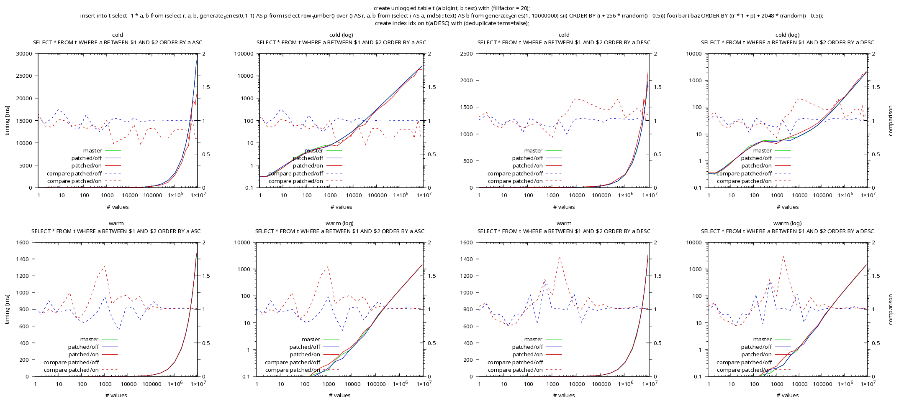
[pdf](pdf/24-worker.pdf)
[dataset](20251213-171700/datasets/24)
[Q1](20251213-171700/templates/SELECT * FROM t WHERE a BETWEEN $1 AND $2 ORDER BY a ASC)
[Q2](20251213-171700/templates/SELECT * FROM t WHERE a BETWEEN $1 AND $2 ORDER BY a DESC)
[Q3](20251213-171700/templates/SELECT * FROM t WHERE a BETWEEN $1 AND $2 ORDER BY a ASC)
[Q4](20251213-171700/templates/SELECT * FROM t WHERE a BETWEEN $1 AND $2 ORDER BY a DESC)
## 25
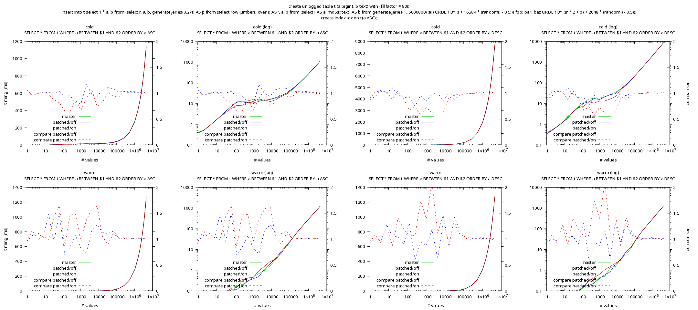
[pdf](pdf/25-worker.pdf)
[dataset](20251213-171700/datasets/25)
[Q1](20251213-171700/templates/SELECT * FROM t WHERE a BETWEEN $1 AND $2 ORDER BY a ASC)
[Q2](20251213-171700/templates/SELECT * FROM t WHERE a BETWEEN $1 AND $2 ORDER BY a DESC)
[Q3](20251213-171700/templates/SELECT * FROM t WHERE a BETWEEN $1 AND $2 ORDER BY a ASC)
[Q4](20251213-171700/templates/SELECT * FROM t WHERE a BETWEEN $1 AND $2 ORDER BY a DESC)
## 26
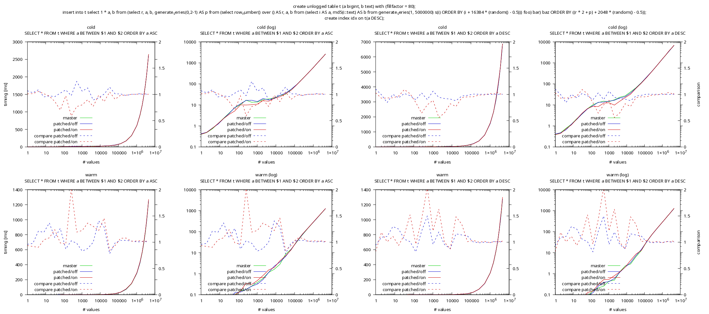
[pdf](pdf/26-worker.pdf)
[dataset](20251213-171700/datasets/26)
[Q1](20251213-171700/templates/SELECT * FROM t WHERE a BETWEEN $1 AND $2 ORDER BY a ASC)
[Q2](20251213-171700/templates/SELECT * FROM t WHERE a BETWEEN $1 AND $2 ORDER BY a DESC)
[Q3](20251213-171700/templates/SELECT * FROM t WHERE a BETWEEN $1 AND $2 ORDER BY a ASC)
[Q4](20251213-171700/templates/SELECT * FROM t WHERE a BETWEEN $1 AND $2 ORDER BY a DESC)
## 27
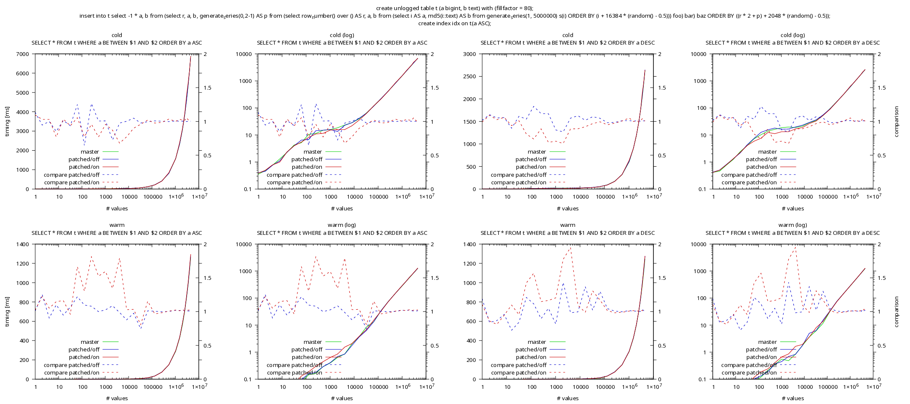
[pdf](pdf/27-worker.pdf)
[dataset](20251213-171700/datasets/27)
[Q1](20251213-171700/templates/SELECT * FROM t WHERE a BETWEEN $1 AND $2 ORDER BY a ASC)
[Q2](20251213-171700/templates/SELECT * FROM t WHERE a BETWEEN $1 AND $2 ORDER BY a DESC)
[Q3](20251213-171700/templates/SELECT * FROM t WHERE a BETWEEN $1 AND $2 ORDER BY a ASC)
[Q4](20251213-171700/templates/SELECT * FROM t WHERE a BETWEEN $1 AND $2 ORDER BY a DESC)
## 28
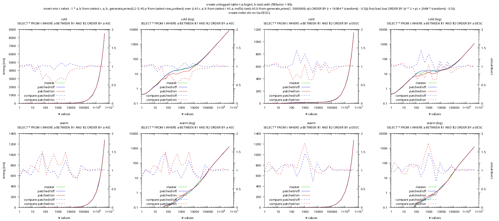
[pdf](pdf/28-worker.pdf)
[dataset](20251213-171700/datasets/28)
[Q1](20251213-171700/templates/SELECT * FROM t WHERE a BETWEEN $1 AND $2 ORDER BY a ASC)
[Q2](20251213-171700/templates/SELECT * FROM t WHERE a BETWEEN $1 AND $2 ORDER BY a DESC)
[Q3](20251213-171700/templates/SELECT * FROM t WHERE a BETWEEN $1 AND $2 ORDER BY a ASC)
[Q4](20251213-171700/templates/SELECT * FROM t WHERE a BETWEEN $1 AND $2 ORDER BY a DESC)
## 29
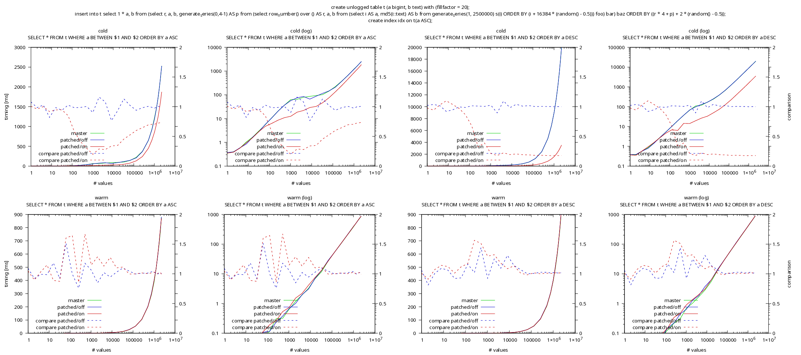
[pdf](pdf/29-worker.pdf)
[dataset](20251213-171700/datasets/29)
[Q1](20251213-171700/templates/SELECT * FROM t WHERE a BETWEEN $1 AND $2 ORDER BY a ASC)
[Q2](20251213-171700/templates/SELECT * FROM t WHERE a BETWEEN $1 AND $2 ORDER BY a DESC)
[Q3](20251213-171700/templates/SELECT * FROM t WHERE a BETWEEN $1 AND $2 ORDER BY a ASC)
[Q4](20251213-171700/templates/SELECT * FROM t WHERE a BETWEEN $1 AND $2 ORDER BY a DESC)
## 30
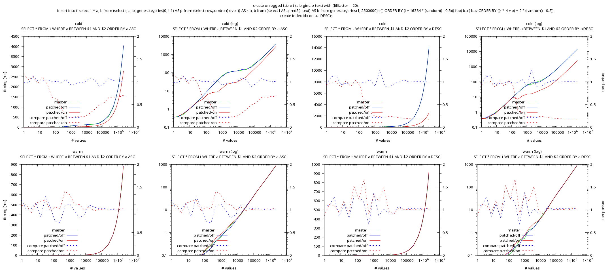
[pdf](pdf/30-worker.pdf)
[dataset](20251213-171700/datasets/30)
[Q1](20251213-171700/templates/SELECT * FROM t WHERE a BETWEEN $1 AND $2 ORDER BY a ASC)
[Q2](20251213-171700/templates/SELECT * FROM t WHERE a BETWEEN $1 AND $2 ORDER BY a DESC)
[Q3](20251213-171700/templates/SELECT * FROM t WHERE a BETWEEN $1 AND $2 ORDER BY a ASC)
[Q4](20251213-171700/templates/SELECT * FROM t WHERE a BETWEEN $1 AND $2 ORDER BY a DESC)
## 31
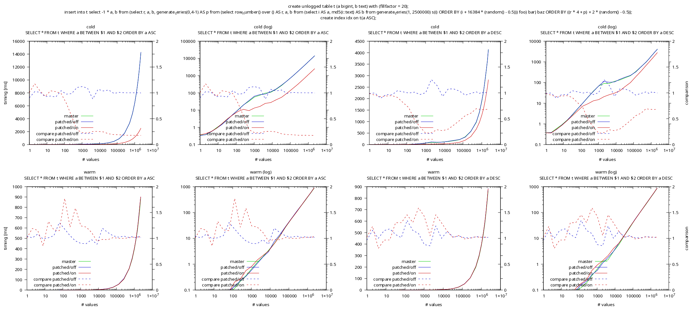
[pdf](pdf/31-worker.pdf)
[dataset](20251213-171700/datasets/31)
[Q1](20251213-171700/templates/SELECT * FROM t WHERE a BETWEEN $1 AND $2 ORDER BY a ASC)
[Q2](20251213-171700/templates/SELECT * FROM t WHERE a BETWEEN $1 AND $2 ORDER BY a DESC)
[Q3](20251213-171700/templates/SELECT * FROM t WHERE a BETWEEN $1 AND $2 ORDER BY a ASC)
[Q4](20251213-171700/templates/SELECT * FROM t WHERE a BETWEEN $1 AND $2 ORDER BY a DESC)
## 32
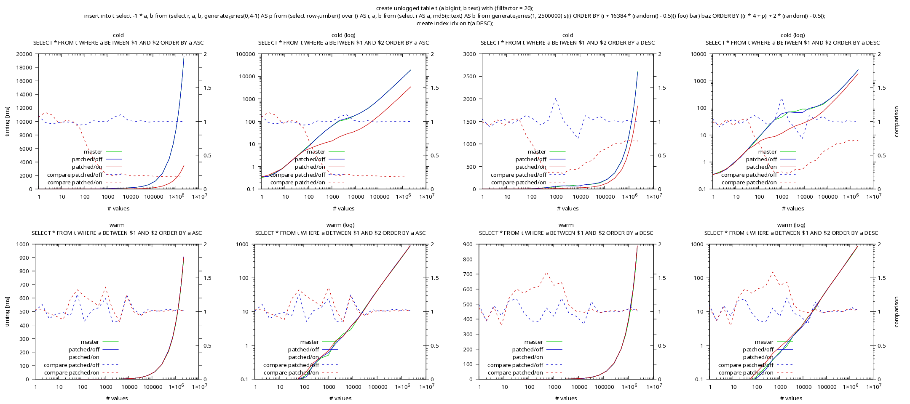
[pdf](pdf/32-worker.pdf)
[dataset](20251213-171700/datasets/32)
[Q1](20251213-171700/templates/SELECT * FROM t WHERE a BETWEEN $1 AND $2 ORDER BY a ASC)
[Q2](20251213-171700/templates/SELECT * FROM t WHERE a BETWEEN $1 AND $2 ORDER BY a DESC)
[Q3](20251213-171700/templates/SELECT * FROM t WHERE a BETWEEN $1 AND $2 ORDER BY a ASC)
[Q4](20251213-171700/templates/SELECT * FROM t WHERE a BETWEEN $1 AND $2 ORDER BY a DESC)
## 33
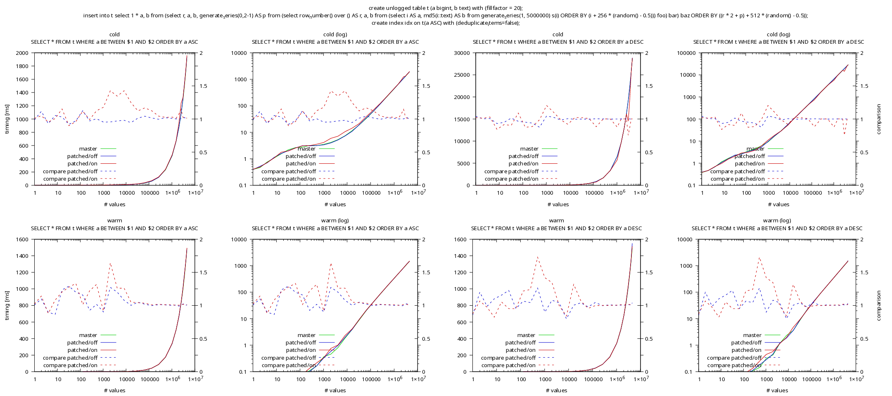
[pdf](pdf/33-worker.pdf)
[dataset](20251213-171700/datasets/33)
[Q1](20251213-171700/templates/SELECT * FROM t WHERE a BETWEEN $1 AND $2 ORDER BY a ASC)
[Q2](20251213-171700/templates/SELECT * FROM t WHERE a BETWEEN $1 AND $2 ORDER BY a DESC)
[Q3](20251213-171700/templates/SELECT * FROM t WHERE a BETWEEN $1 AND $2 ORDER BY a ASC)
[Q4](20251213-171700/templates/SELECT * FROM t WHERE a BETWEEN $1 AND $2 ORDER BY a DESC)
## 34
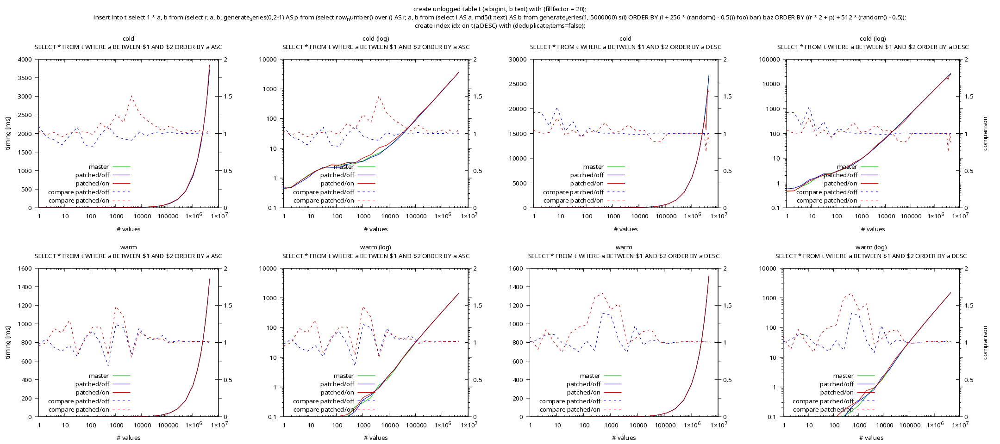
[pdf](pdf/34-worker.pdf)
[dataset](20251213-171700/datasets/34)
[Q1](20251213-171700/templates/SELECT * FROM t WHERE a BETWEEN $1 AND $2 ORDER BY a ASC)
[Q2](20251213-171700/templates/SELECT * FROM t WHERE a BETWEEN $1 AND $2 ORDER BY a DESC)
[Q3](20251213-171700/templates/SELECT * FROM t WHERE a BETWEEN $1 AND $2 ORDER BY a ASC)
[Q4](20251213-171700/templates/SELECT * FROM t WHERE a BETWEEN $1 AND $2 ORDER BY a DESC)
## 35
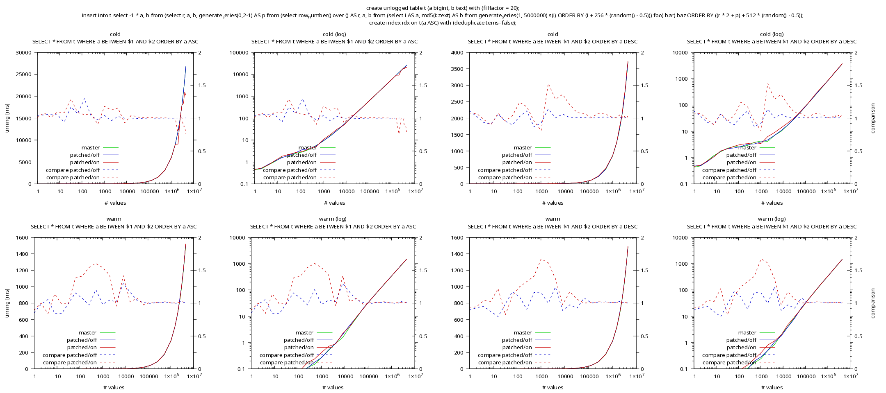
[pdf](pdf/35-worker.pdf)
[dataset](20251213-171700/datasets/35)
[Q1](20251213-171700/templates/SELECT * FROM t WHERE a BETWEEN $1 AND $2 ORDER BY a ASC)
[Q2](20251213-171700/templates/SELECT * FROM t WHERE a BETWEEN $1 AND $2 ORDER BY a DESC)
[Q3](20251213-171700/templates/SELECT * FROM t WHERE a BETWEEN $1 AND $2 ORDER BY a ASC)
[Q4](20251213-171700/templates/SELECT * FROM t WHERE a BETWEEN $1 AND $2 ORDER BY a DESC)
## 36
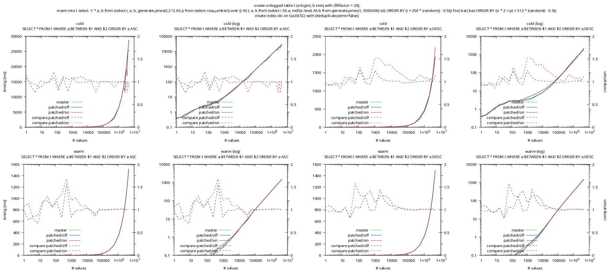
[pdf](pdf/36-worker.pdf)
[dataset](20251213-171700/datasets/36)
[Q1](20251213-171700/templates/SELECT * FROM t WHERE a BETWEEN $1 AND $2 ORDER BY a ASC)
[Q2](20251213-171700/templates/SELECT * FROM t WHERE a BETWEEN $1 AND $2 ORDER BY a DESC)
[Q3](20251213-171700/templates/SELECT * FROM t WHERE a BETWEEN $1 AND $2 ORDER BY a ASC)
[Q4](20251213-171700/templates/SELECT * FROM t WHERE a BETWEEN $1 AND $2 ORDER BY a DESC)
## 37
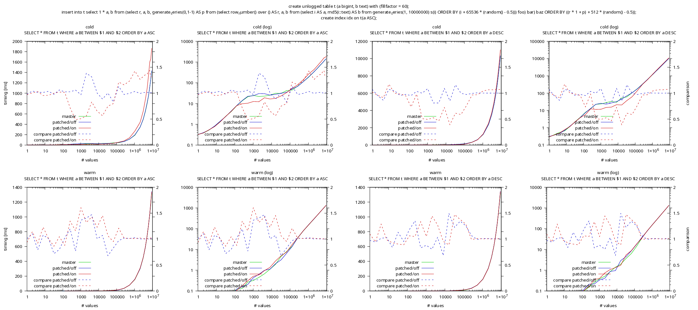
[pdf](pdf/37-worker.pdf)
[dataset](20251213-171700/datasets/37)
[Q1](20251213-171700/templates/SELECT * FROM t WHERE a BETWEEN $1 AND $2 ORDER BY a ASC)
[Q2](20251213-171700/templates/SELECT * FROM t WHERE a BETWEEN $1 AND $2 ORDER BY a DESC)
[Q3](20251213-171700/templates/SELECT * FROM t WHERE a BETWEEN $1 AND $2 ORDER BY a ASC)
[Q4](20251213-171700/templates/SELECT * FROM t WHERE a BETWEEN $1 AND $2 ORDER BY a DESC)
## 38
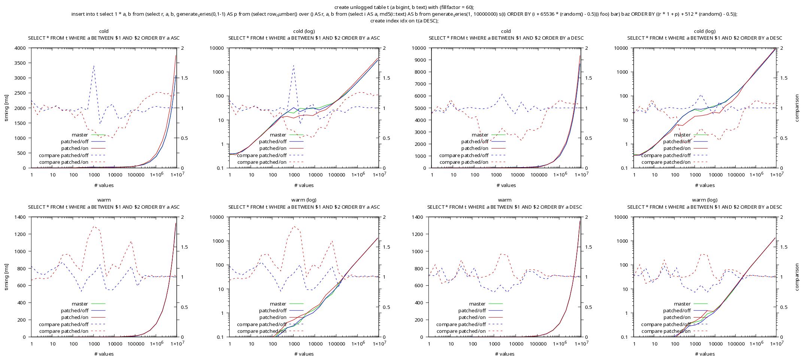
[pdf](pdf/38-worker.pdf)
[dataset](20251213-171700/datasets/38)
[Q1](20251213-171700/templates/SELECT * FROM t WHERE a BETWEEN $1 AND $2 ORDER BY a ASC)
[Q2](20251213-171700/templates/SELECT * FROM t WHERE a BETWEEN $1 AND $2 ORDER BY a DESC)
[Q3](20251213-171700/templates/SELECT * FROM t WHERE a BETWEEN $1 AND $2 ORDER BY a ASC)
[Q4](20251213-171700/templates/SELECT * FROM t WHERE a BETWEEN $1 AND $2 ORDER BY a DESC)
## 39
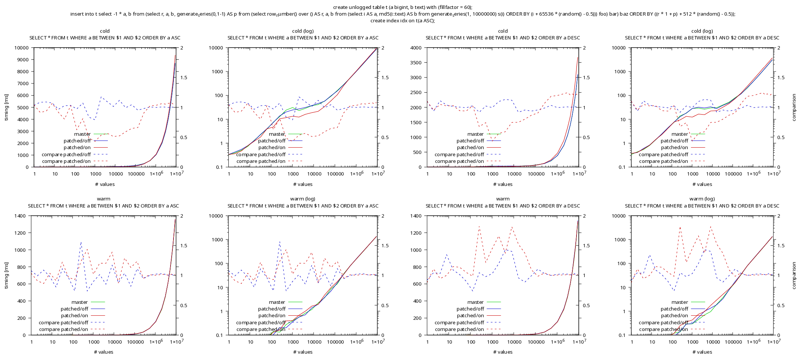
[pdf](pdf/39-worker.pdf)
[dataset](20251213-171700/datasets/39)
[Q1](20251213-171700/templates/SELECT * FROM t WHERE a BETWEEN $1 AND $2 ORDER BY a ASC)
[Q2](20251213-171700/templates/SELECT * FROM t WHERE a BETWEEN $1 AND $2 ORDER BY a DESC)
[Q3](20251213-171700/templates/SELECT * FROM t WHERE a BETWEEN $1 AND $2 ORDER BY a ASC)
[Q4](20251213-171700/templates/SELECT * FROM t WHERE a BETWEEN $1 AND $2 ORDER BY a DESC)
## 40
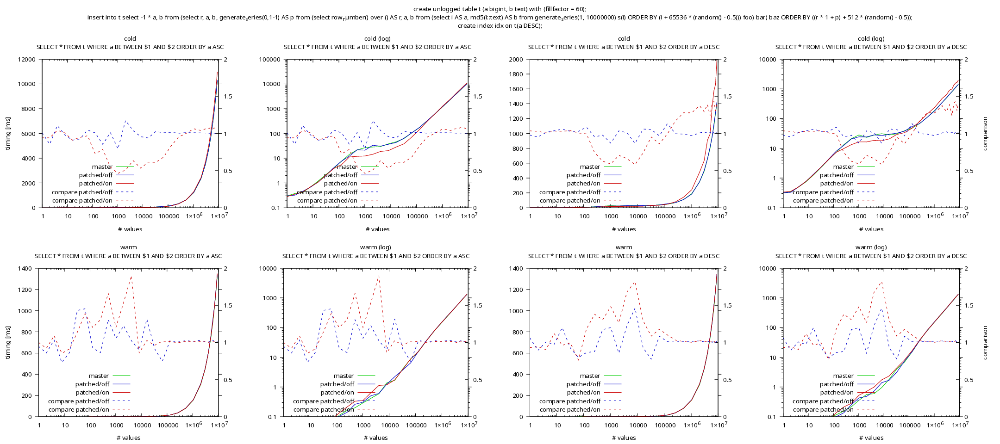
[pdf](pdf/40-worker.pdf)
[dataset](20251213-171700/datasets/40)
[Q1](20251213-171700/templates/SELECT * FROM t WHERE a BETWEEN $1 AND $2 ORDER BY a ASC)
[Q2](20251213-171700/templates/SELECT * FROM t WHERE a BETWEEN $1 AND $2 ORDER BY a DESC)
[Q3](20251213-171700/templates/SELECT * FROM t WHERE a BETWEEN $1 AND $2 ORDER BY a ASC)
[Q4](20251213-171700/templates/SELECT * FROM t WHERE a BETWEEN $1 AND $2 ORDER BY a DESC)
## 41
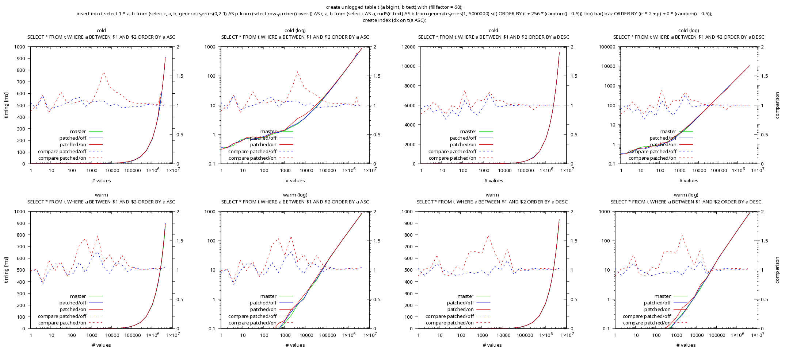
[pdf](pdf/41-worker.pdf)
[dataset](20251213-171700/datasets/41)
[Q1](20251213-171700/templates/SELECT * FROM t WHERE a BETWEEN $1 AND $2 ORDER BY a ASC)
[Q2](20251213-171700/templates/SELECT * FROM t WHERE a BETWEEN $1 AND $2 ORDER BY a DESC)
[Q3](20251213-171700/templates/SELECT * FROM t WHERE a BETWEEN $1 AND $2 ORDER BY a ASC)
[Q4](20251213-171700/templates/SELECT * FROM t WHERE a BETWEEN $1 AND $2 ORDER BY a DESC)
## 42
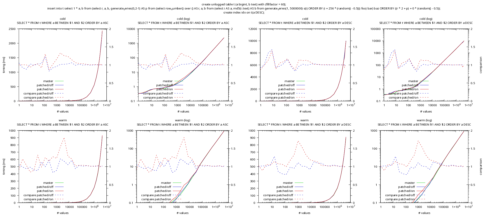
[pdf](pdf/42-worker.pdf)
[dataset](20251213-171700/datasets/42)
[Q1](20251213-171700/templates/SELECT * FROM t WHERE a BETWEEN $1 AND $2 ORDER BY a ASC)
[Q2](20251213-171700/templates/SELECT * FROM t WHERE a BETWEEN $1 AND $2 ORDER BY a DESC)
[Q3](20251213-171700/templates/SELECT * FROM t WHERE a BETWEEN $1 AND $2 ORDER BY a ASC)
[Q4](20251213-171700/templates/SELECT * FROM t WHERE a BETWEEN $1 AND $2 ORDER BY a DESC)
## 43
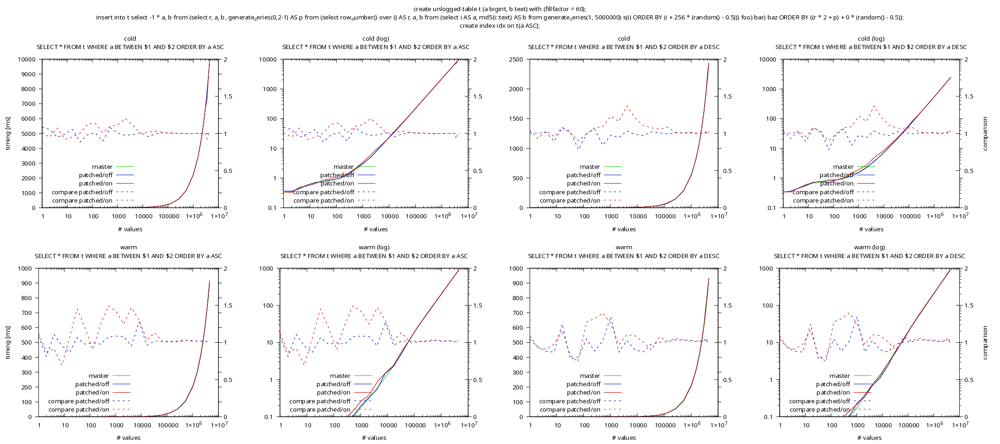
[pdf](pdf/43-worker.pdf)
[dataset](20251213-171700/datasets/43)
[Q1](20251213-171700/templates/SELECT * FROM t WHERE a BETWEEN $1 AND $2 ORDER BY a ASC)
[Q2](20251213-171700/templates/SELECT * FROM t WHERE a BETWEEN $1 AND $2 ORDER BY a DESC)
[Q3](20251213-171700/templates/SELECT * FROM t WHERE a BETWEEN $1 AND $2 ORDER BY a ASC)
[Q4](20251213-171700/templates/SELECT * FROM t WHERE a BETWEEN $1 AND $2 ORDER BY a DESC)
## 44
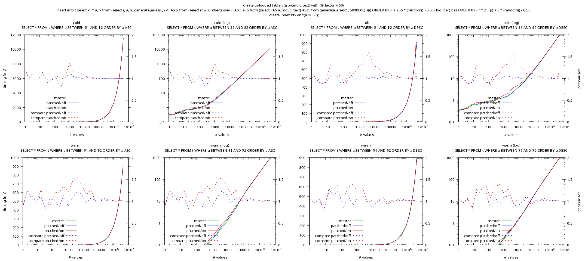
[pdf](pdf/44-worker.pdf)
[dataset](20251213-171700/datasets/44)
[Q1](20251213-171700/templates/SELECT * FROM t WHERE a BETWEEN $1 AND $2 ORDER BY a ASC)
[Q2](20251213-171700/templates/SELECT * FROM t WHERE a BETWEEN $1 AND $2 ORDER BY a DESC)
[Q3](20251213-171700/templates/SELECT * FROM t WHERE a BETWEEN $1 AND $2 ORDER BY a ASC)
[Q4](20251213-171700/templates/SELECT * FROM t WHERE a BETWEEN $1 AND $2 ORDER BY a DESC)
## 45
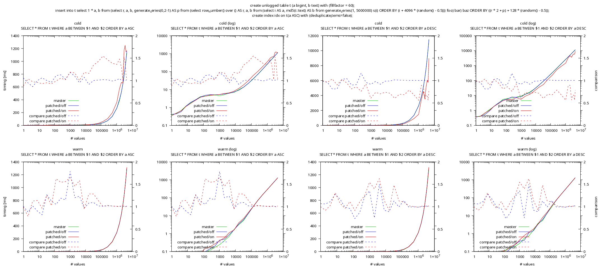
[pdf](pdf/45-worker.pdf)
[dataset](20251213-171700/datasets/45)
[Q1](20251213-171700/templates/SELECT * FROM t WHERE a BETWEEN $1 AND $2 ORDER BY a ASC)
[Q2](20251213-171700/templates/SELECT * FROM t WHERE a BETWEEN $1 AND $2 ORDER BY a DESC)
[Q3](20251213-171700/templates/SELECT * FROM t WHERE a BETWEEN $1 AND $2 ORDER BY a ASC)
[Q4](20251213-171700/templates/SELECT * FROM t WHERE a BETWEEN $1 AND $2 ORDER BY a DESC)
## 46

[pdf](pdf/46-worker.pdf)
[dataset](20251213-171700/datasets/46)
[Q1](20251213-171700/templates/SELECT * FROM t WHERE a BETWEEN $1 AND $2 ORDER BY a ASC)
[Q2](20251213-171700/templates/SELECT * FROM t WHERE a BETWEEN $1 AND $2 ORDER BY a DESC)
[Q3](20251213-171700/templates/SELECT * FROM t WHERE a BETWEEN $1 AND $2 ORDER BY a ASC)
[Q4](20251213-171700/templates/SELECT * FROM t WHERE a BETWEEN $1 AND $2 ORDER BY a DESC)
