## 1
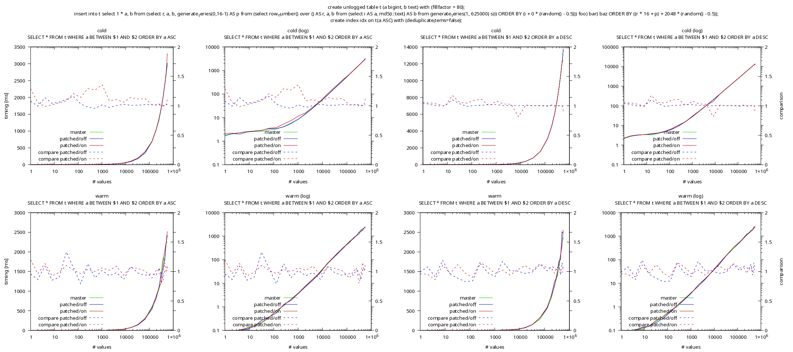
[pdf](pdf/1-worker.pdf)
[dataset](../../20251213-171740/datasets/1)
[Q1](../../20251213-171740/templates/3)
[Q2](../../20251213-171740/templates/2)
[Q3](../../20251213-171740/templates/3)
[Q4](../../20251213-171740/templates/2)
## 2
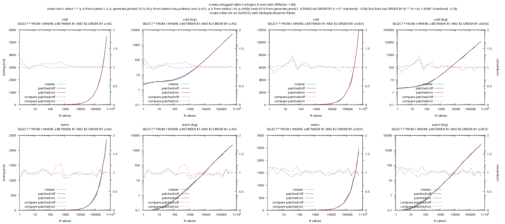
[pdf](pdf/2-worker.pdf)
[dataset](../../20251213-171740/datasets/2)
[Q1](../../20251213-171740/templates/7)
[Q2](../../20251213-171740/templates/8)
[Q3](../../20251213-171740/templates/5)
[Q4](../../20251213-171740/templates/6)
## 3
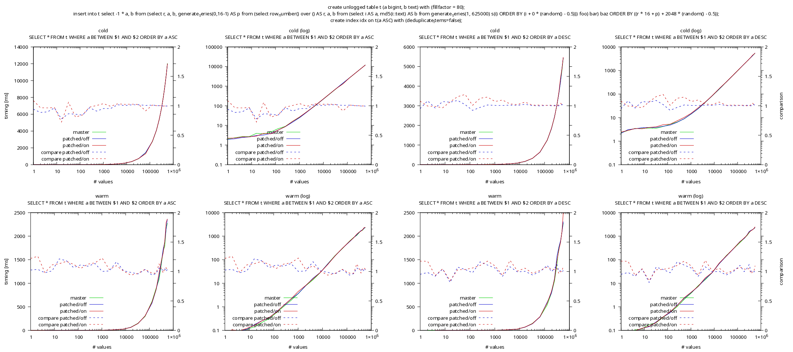
[pdf](pdf/3-worker.pdf)
[dataset](../../20251213-171740/datasets/3)
[Q1](../../20251213-171740/templates/9)
[Q2](../../20251213-171740/templates/10)
[Q3](../../20251213-171740/templates/9)
[Q4](../../20251213-171740/templates/10)
## 4
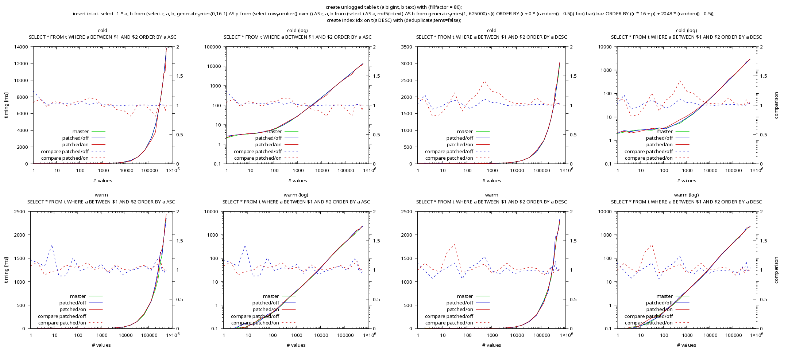
[pdf](pdf/4-worker.pdf)
[dataset](../../20251213-171740/datasets/4)
[Q1](../../20251213-171740/templates/13)
[Q2](../../20251213-171740/templates/16)
[Q3](../../20251213-171740/templates/13)
[Q4](../../20251213-171740/templates/14)
## 5

[pdf](pdf/5-worker.pdf)
[dataset](../../20251213-171740/datasets/5)
[Q1](../../20251213-171740/templates/17)
[Q2](../../20251213-171740/templates/18)
[Q3](../../20251213-171740/templates/17)
[Q4](../../20251213-171740/templates/18)
## 6
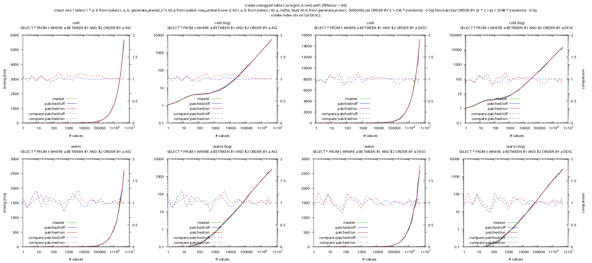
[pdf](pdf/6-worker.pdf)
[dataset](../../20251213-171740/datasets/6)
[Q1](../../20251213-171740/templates/21)
[Q2](../../20251213-171740/templates/22)
[Q3](../../20251213-171740/templates/21)
[Q4](../../20251213-171740/templates/24)
## 7
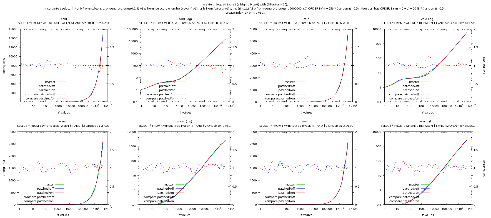
[pdf](pdf/7-worker.pdf)
[dataset](../../20251213-171740/datasets/7)
[Q1](../../20251213-171740/templates/27)
[Q2](../../20251213-171740/templates/26)
[Q3](../../20251213-171740/templates/25)
[Q4](../../20251213-171740/templates/28)
## 8
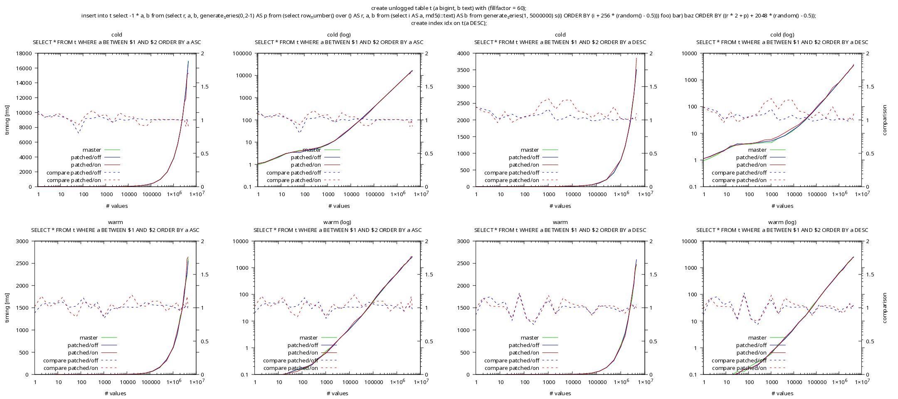
[pdf](pdf/8-worker.pdf)
[dataset](../../20251213-171740/datasets/8)
[Q1](../../20251213-171740/templates/31)
[Q2](../../20251213-171740/templates/32)
[Q3](../../20251213-171740/templates/31)
[Q4](../../20251213-171740/templates/30)
## 9
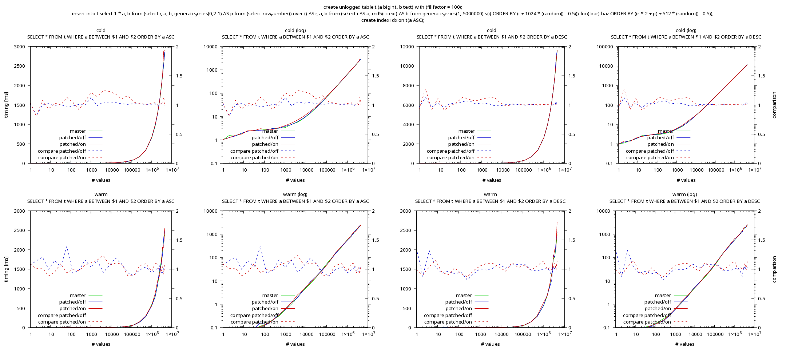
[pdf](pdf/9-worker.pdf)
[dataset](../../20251213-171740/datasets/9)
[Q1](../../20251213-171740/templates/33)
[Q2](../../20251213-171740/templates/36)
[Q3](../../20251213-171740/templates/33)
[Q4](../../20251213-171740/templates/36)
## 10
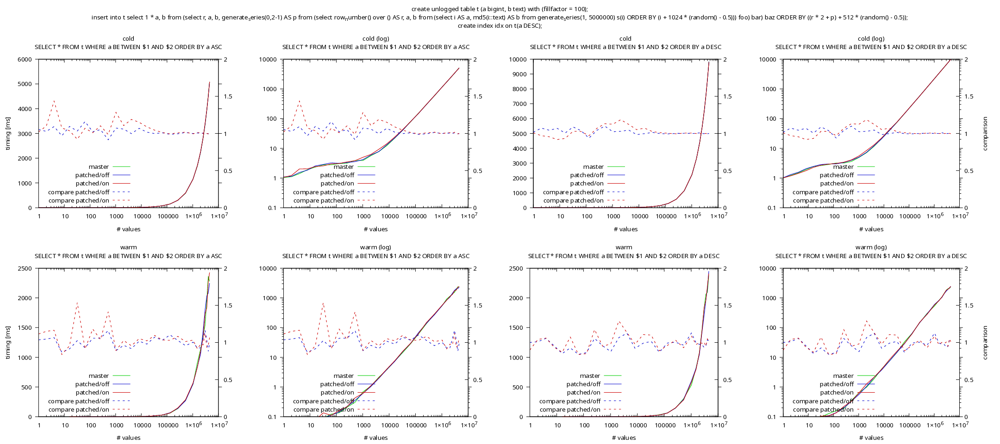
[pdf](pdf/10-worker.pdf)
[dataset](../../20251213-171740/datasets/10)
[Q1](../../20251213-171740/templates/37)
[Q2](../../20251213-171740/templates/40)
[Q3](../../20251213-171740/templates/37)
[Q4](../../20251213-171740/templates/38)
## 11
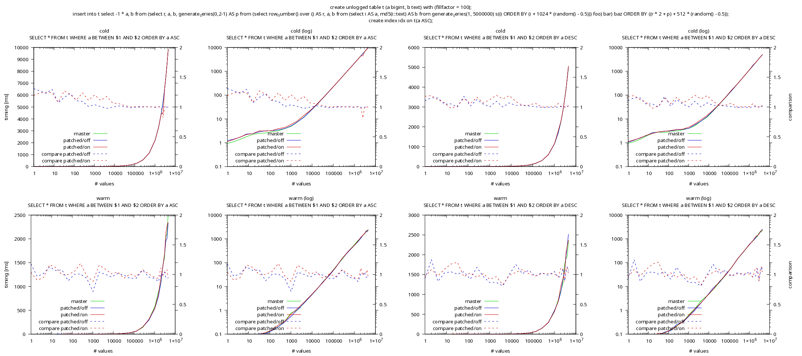
[pdf](pdf/11-worker.pdf)
[dataset](../../20251213-171740/datasets/11)
[Q1](../../20251213-171740/templates/43)
[Q2](../../20251213-171740/templates/42)
[Q3](../../20251213-171740/templates/41)
[Q4](../../20251213-171740/templates/42)
## 12
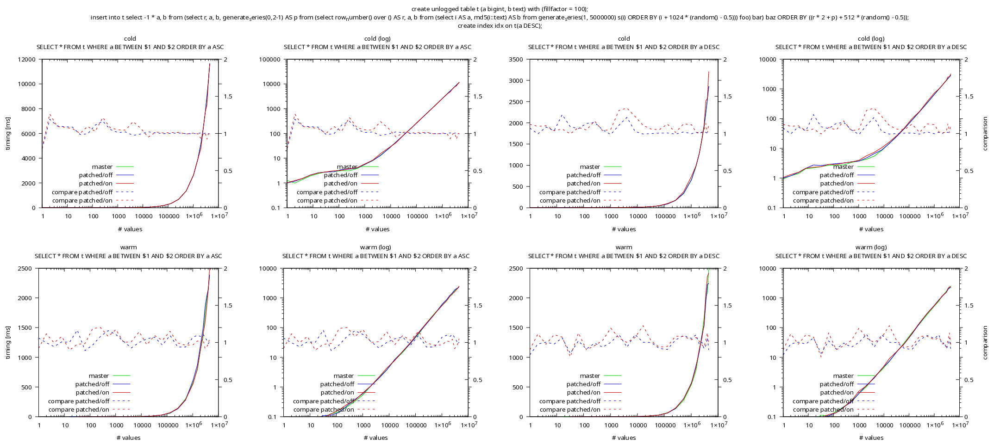
[pdf](pdf/12-worker.pdf)
[dataset](../../20251213-171740/datasets/12)
[Q1](../../20251213-171740/templates/45)
[Q2](../../20251213-171740/templates/48)
[Q3](../../20251213-171740/templates/47)
[Q4](../../20251213-171740/templates/46)
## 13
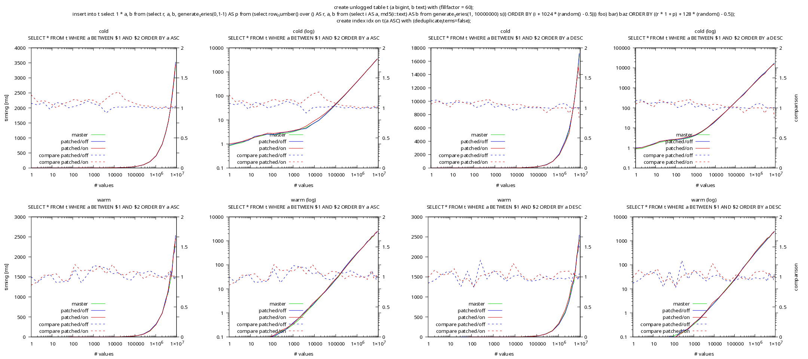
[pdf](pdf/13-worker.pdf)
[dataset](../../20251213-171740/datasets/13)
[Q1](../../20251213-171740/templates/49)
[Q2](../../20251213-171740/templates/50)
[Q3](../../20251213-171740/templates/49)
[Q4](../../20251213-171740/templates/50)
## 14
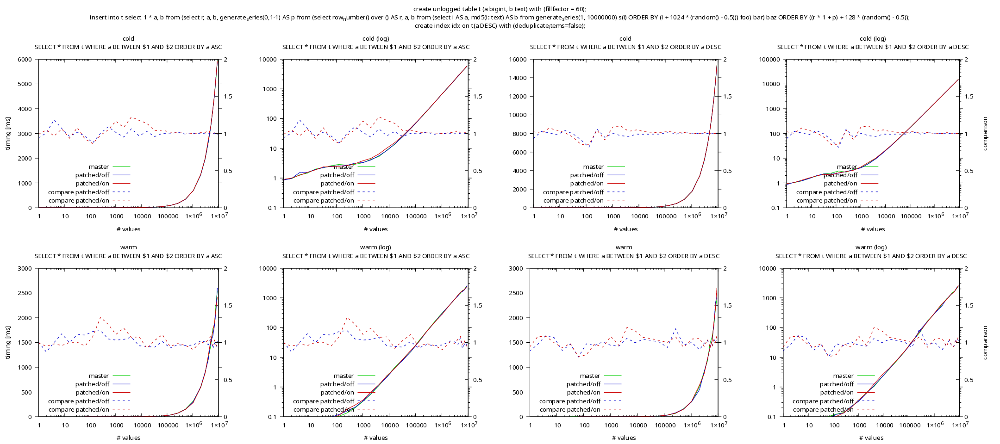
[pdf](pdf/14-worker.pdf)
[dataset](../../20251213-171740/datasets/14)
[Q1](../../20251213-171740/templates/53)
[Q2](../../20251213-171740/templates/56)
[Q3](../../20251213-171740/templates/55)
[Q4](../../20251213-171740/templates/56)
## 15
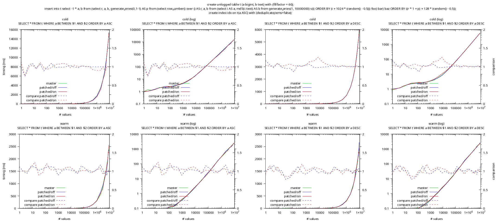
[pdf](pdf/15-worker.pdf)
[dataset](../../20251213-171740/datasets/15)
[Q1](../../20251213-171740/templates/57)
[Q2](../../20251213-171740/templates/58)
[Q3](../../20251213-171740/templates/57)
[Q4](../../20251213-171740/templates/60)
## 16
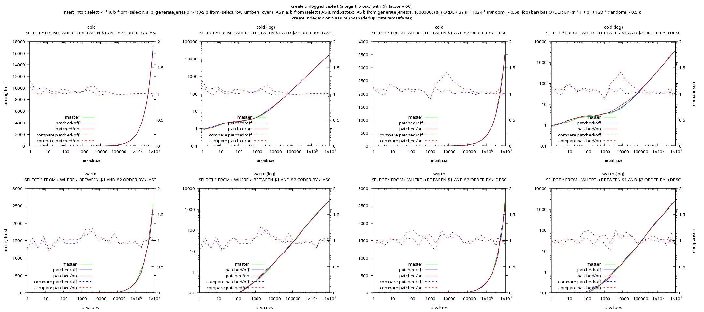
[pdf](pdf/16-worker.pdf)
[dataset](../../20251213-171740/datasets/16)
[Q1](../../20251213-171740/templates/61)
[Q2](../../20251213-171740/templates/64)
[Q3](../../20251213-171740/templates/61)
[Q4](../../20251213-171740/templates/62)
## 17
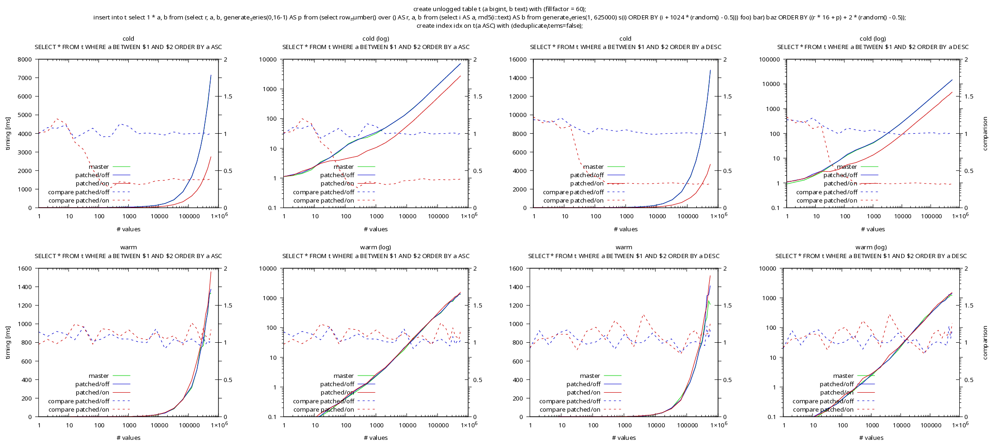
[pdf](pdf/17-worker.pdf)
[dataset](../../20251213-171740/datasets/17)
[Q1](../../20251213-171740/templates/65)
[Q2](../../20251213-171740/templates/66)
[Q3](../../20251213-171740/templates/65)
[Q4](../../20251213-171740/templates/66)
## 18
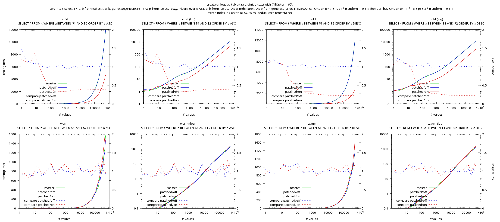
[pdf](pdf/18-worker.pdf)
[dataset](../../20251213-171740/datasets/18)
[Q1](../../20251213-171740/templates/71)
[Q2](../../20251213-171740/templates/72)
[Q3](../../20251213-171740/templates/71)
[Q4](../../20251213-171740/templates/72)
## 19
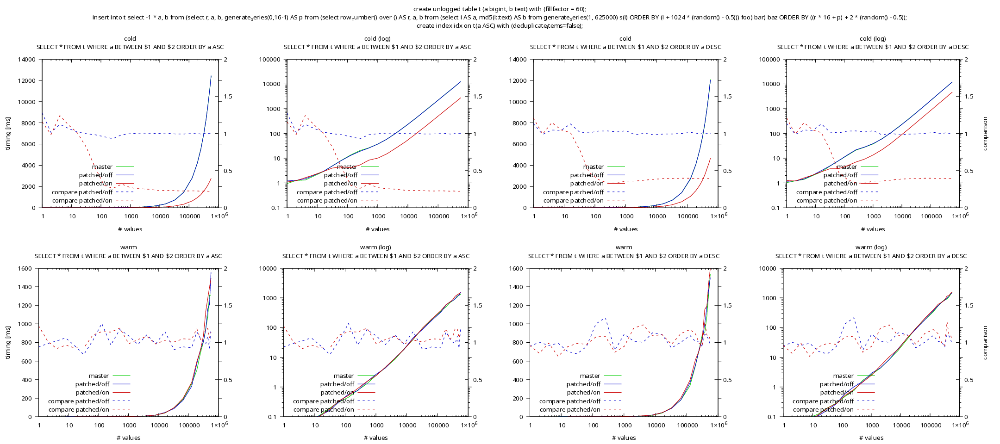
[pdf](pdf/19-worker.pdf)
[dataset](../../20251213-171740/datasets/19)
[Q1](../../20251213-171740/templates/73)
[Q2](../../20251213-171740/templates/74)
[Q3](../../20251213-171740/templates/73)
[Q4](../../20251213-171740/templates/74)
## 20
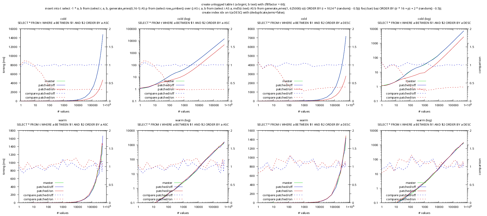
[pdf](pdf/20-worker.pdf)
[dataset](../../20251213-171740/datasets/20)
[Q1](../../20251213-171740/templates/79)
[Q2](../../20251213-171740/templates/80)
[Q3](../../20251213-171740/templates/77)
[Q4](../../20251213-171740/templates/80)
## 21
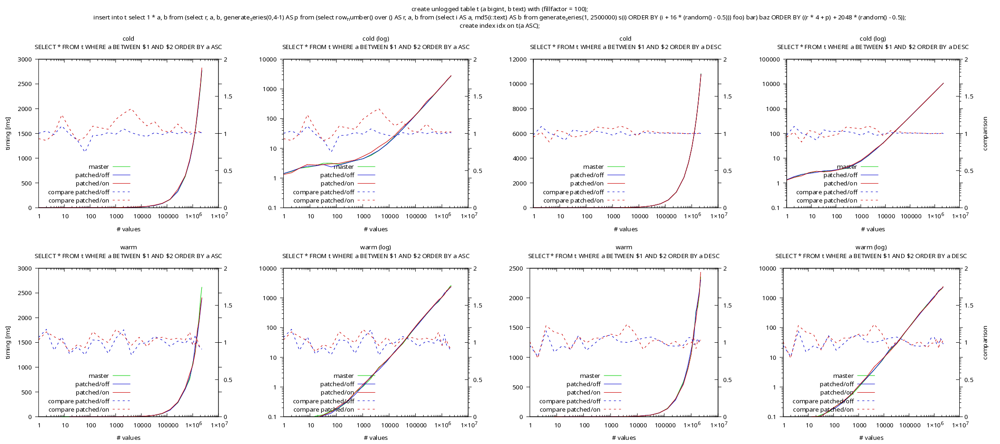
[pdf](pdf/21-worker.pdf)
[dataset](../../20251213-171740/datasets/21)
[Q1](../../20251213-171740/templates/81)
[Q2](../../20251213-171740/templates/82)
[Q3](../../20251213-171740/templates/83)
[Q4](../../20251213-171740/templates/82)
## 22
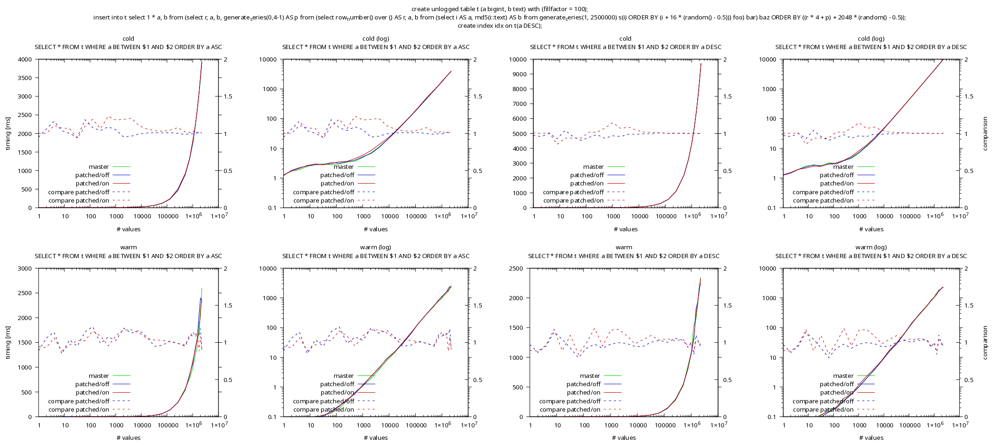
[pdf](pdf/22-worker.pdf)
[dataset](../../20251213-171740/datasets/22)
[Q1](../../20251213-171740/templates/87)
[Q2](../../20251213-171740/templates/86)
[Q3](../../20251213-171740/templates/85)
[Q4](../../20251213-171740/templates/88)
## 23
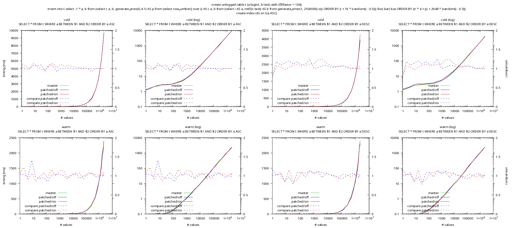
[pdf](pdf/23-worker.pdf)
[dataset](../../20251213-171740/datasets/23)
[Q1](../../20251213-171740/templates/89)
[Q2](../../20251213-171740/templates/92)
[Q3](../../20251213-171740/templates/89)
[Q4](../../20251213-171740/templates/90)
## 24
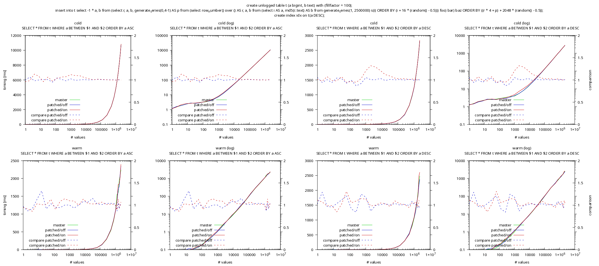
[pdf](pdf/24-worker.pdf)
[dataset](../../20251213-171740/datasets/24)
[Q1](../../20251213-171740/templates/93)
[Q2](../../20251213-171740/templates/96)
[Q3](../../20251213-171740/templates/95)
[Q4](../../20251213-171740/templates/96)
## 25
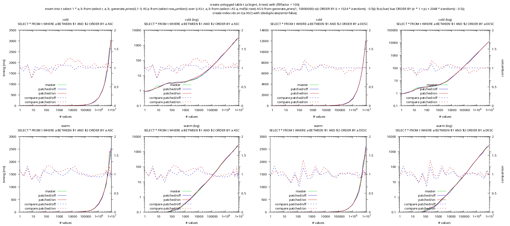
[pdf](pdf/25-worker.pdf)
[dataset](../../20251213-171740/datasets/25)
[Q1](../../20251213-171740/templates/99)
[Q2](../../20251213-171740/templates/98)
[Q3](../../20251213-171740/templates/97)
[Q4](../../20251213-171740/templates/100)
## 26
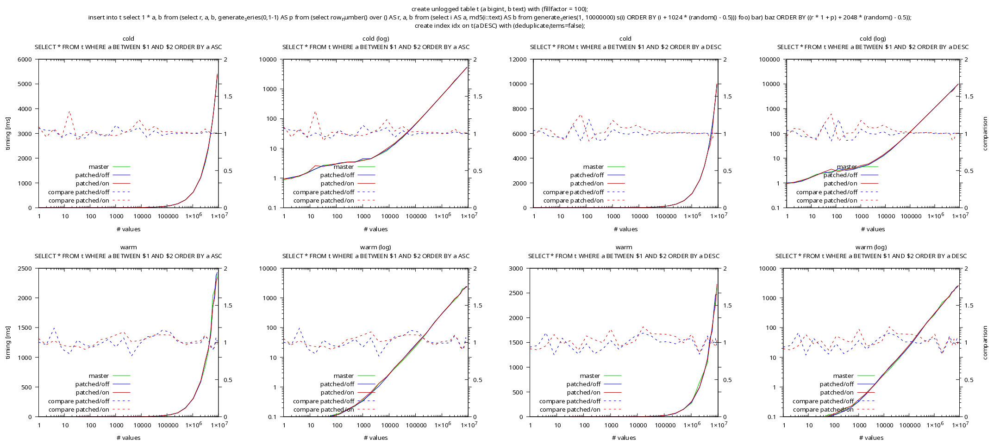
[pdf](pdf/26-worker.pdf)
[dataset](../../20251213-171740/datasets/26)
[Q1](../../20251213-171740/templates/103)
[Q2](../../20251213-171740/templates/104)
[Q3](../../20251213-171740/templates/103)
[Q4](../../20251213-171740/templates/104)
## 27
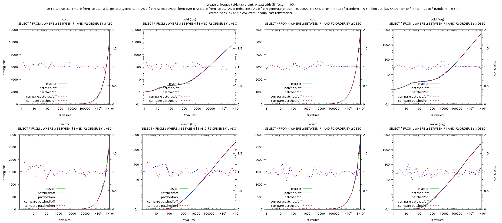
[pdf](pdf/27-worker.pdf)
[dataset](../../20251213-171740/datasets/27)
[Q1](../../20251213-171740/templates/105)
[Q2](../../20251213-171740/templates/106)
[Q3](../../20251213-171740/templates/107)
[Q4](../../20251213-171740/templates/108)
## 28
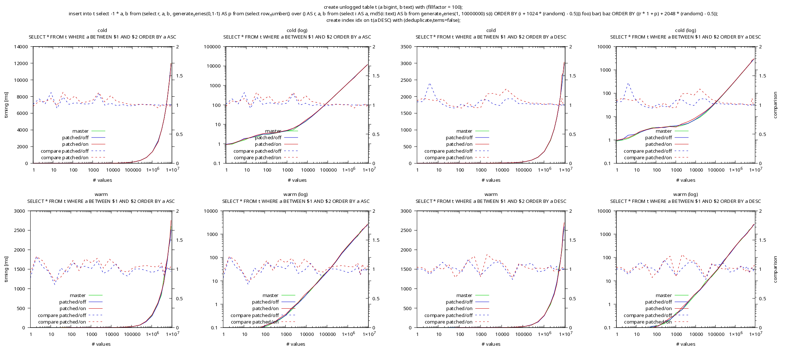
[pdf](pdf/28-worker.pdf)
[dataset](../../20251213-171740/datasets/28)
[Q1](../../20251213-171740/templates/111)
[Q2](../../20251213-171740/templates/112)
[Q3](../../20251213-171740/templates/111)
[Q4](../../20251213-171740/templates/110)
## 29
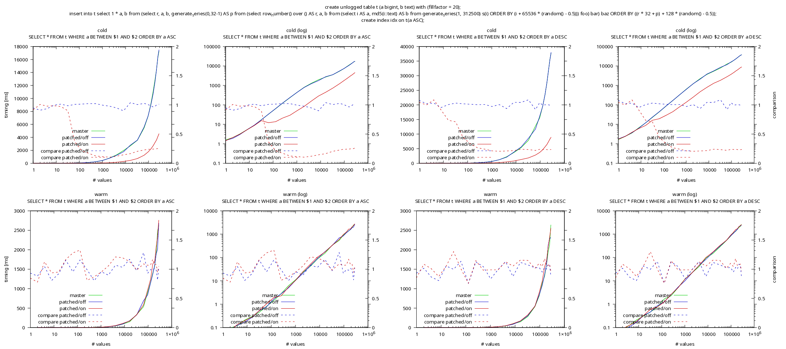
[pdf](pdf/29-worker.pdf)
[dataset](../../20251213-171740/datasets/29)
[Q1](../../20251213-171740/templates/113)
[Q2](../../20251213-171740/templates/116)
[Q3](../../20251213-171740/templates/113)
[Q4](../../20251213-171740/templates/116)
## 30
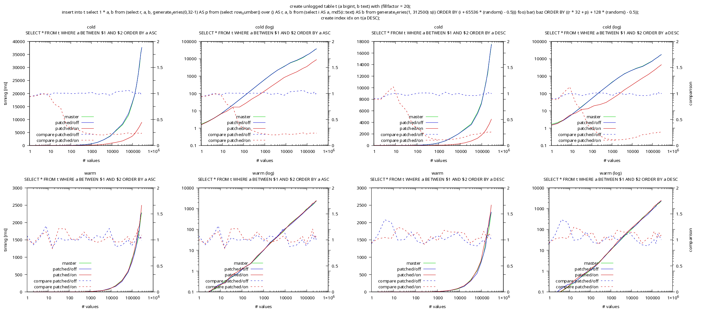
[pdf](pdf/30-worker.pdf)
[dataset](../../20251213-171740/datasets/30)
[Q1](../../20251213-171740/templates/117)
[Q2](../../20251213-171740/templates/120)
[Q3](../../20251213-171740/templates/119)
[Q4](../../20251213-171740/templates/120)
## 31
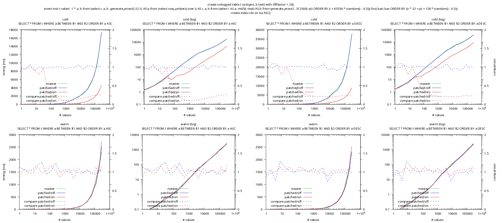
[pdf](pdf/31-worker.pdf)
[dataset](../../20251213-171740/datasets/31)
[Q1](../../20251213-171740/templates/123)
[Q2](../../20251213-171740/templates/124)
[Q3](../../20251213-171740/templates/121)
[Q4](../../20251213-171740/templates/122)
## 32
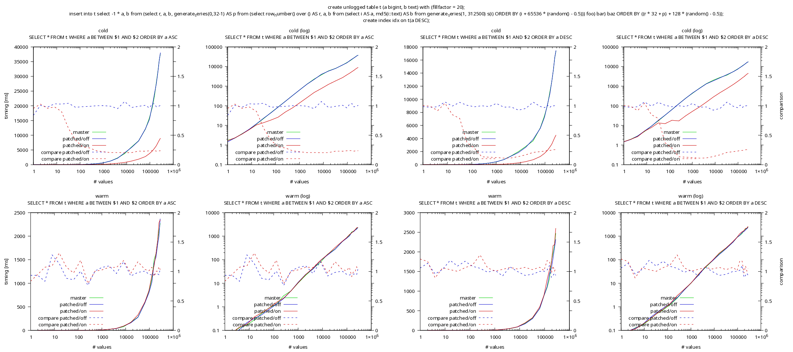
[pdf](pdf/32-worker.pdf)
[dataset](../../20251213-171740/datasets/32)
[Q1](../../20251213-171740/templates/127)
[Q2](../../20251213-171740/templates/126)
[Q3](../../20251213-171740/templates/125)
[Q4](../../20251213-171740/templates/126)
